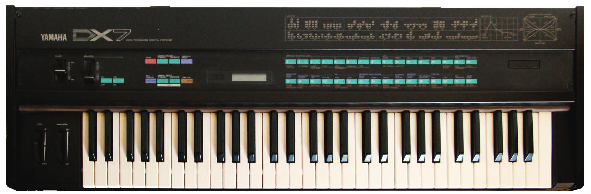

# 0.0 Why study computer music?

Have you ever wondered how sound and music are stored on and processed by computers? Or how plugins in your digital audio workstation are working behind the scenes? If so, then you are already asking questions in the domain of _computer music_. This book is an invitation to take those questions seriously, and to develop the technical _principles_ needed to answer them rigorously.

## Music and computation are inextricably linked

Computing has become ubiquitous within everyday music practice. When you stream a song on your phone, computers are compressing audio, buffering it across a network, and converting digital samples back into sound. When a producer mixes a track in a digital audio workstation (DAW), they are orchestrating thousands of computations per second to filter, equalize, and combine signals. When a researcher trains a generative model to compose new music, computation becomes an engine for creation. When you attend a live show, digital mixing consoles route, equalize, and apply effects to every signal coming off the stage in real time, while in-ear monitor systems compute a personalized mix for each performer.

Even before the advent of digital computers, music and _computation_ in the broader sense have been deeply entwined. The earliest theories of musical instruments were built on numerical relationships: Pythagorean ratios between string lengths, the mathematics of consonance and dissonance. Some of the deepest properties of music, such as pitch and rhythm, are fundamentally about _periodicity_: patterns that repeat in time at definable rates. To study music carefully is, almost unavoidably, to study computation and mathematics.

If you are interested in better understanding these relationships, then computer music is for you.

## Technology is upstream of musical possibility

Music and technology have always co-evolved. In the hands of musicians, new technologies expand the creative and cultural boundaries of what music can be. A pervasive theme throughout music history is that each major technological development opens up new creative opportunities for artists, opportunities that often could not even be articulated until the technology made them imaginable.

The pianoforte's expressive dynamic range allowed Beethoven to compose his sonatas in a way that would have been impossible on the harpsichord. The Beatles wielded the entire studio as an instrument, using multitrack recording technology to make an album like _Revolver_ conceivable. Amplification and electricity transformed the electric guitar into Jimi Hendrix's voice. Digital sampling let Kate Bush build the sonic world of _Hounds of Love_ from fragments of real-world sound.

If you are interested in building new computing tools that may expand the possibilities of music, then computer music is for you.

## Inspiration: _FM Synthesis_

To make this concrete, consider one of the most influential episodes in the history of computer music: John Chowning's invention of _frequency modulation (FM) synthesis_, published in 1973 in the _Journal of the Audio Engineering Society_. Chowning's work is a kind of "full stack" example of what computer music can be, weaving together _acoustics_, _mathematical theory_, _programming_, _instrument design_, and ultimately _musical culture_.

- _Music acoustics_: Real musical sounds are not pure tones. They contain rich mixtures of many time-varying periodic components — partials that fade in, fade out, and shift in relative strength over the duration of a note. Synthesizing such sounds convincingly is challenging, especially with the limited compute available in the 1970s, because each component nominally requires its own oscillator. Consider, for example, the dense spectral fingerprint of a percussive chime instrument:

  ```{admonition} 🔊 Listen
  :class: note listen
  <audio controls src="./assets/fs192645-chime.wav"></audio>

  Orchestral chime. Obtained from Freesound. chimes_f#3_p_1.wav by sgossner — [freesound.org/s/192645](https://freesound.org/s/192645/) — License: Attribution 4.0.
  ```

```{margin} SAIL
The Stanford Artificial Intelligence Laboratory (1963–1980) was a pioneering AI research center where foundational work in robotics and computer music synthesis emerged.
```

- _Mathematical theory_: Working at the Stanford Artificial Intelligence Laboratory (SAIL), Chowning realized that the well-known method of frequency modulation, when applied in the audio range, produces infinitely complex spectra by combining just two simple components in a particular way. The basic FM equation is

  $$x(t) = \sin\left(2 \pi f_c t + I \cdot \sin(2 \pi f_m t)\right).$$

  If this doesn't mean much to you now, no worries - you'll learn more about this equation and its parameters when we [study FM in detail](TODO) later in this text. Focus for now on the high level: Chowning showed that, by carefully controlling these parameters over time, this single equation could imitate a striking range of natural musical sounds:

  ```{admonition} 🔊 Listen
  :class: note listen
  <audio controls src="./assets/bell-fm.mp3"></audio>

  FM bell sound synthesized using Csound `fmbell`.
  ```

- _Efficient programming_: The mathematical elegance of FM is only useful if it can be _computed_ fast enough (tens of thousands of times per second) to produce a continuous audio stream. This requires careful, efficient implementations, bringing an _algorithmic_ perspective to computer music. In Python, an efficient FM synthesizer might look something like:

  ```python
  def fm(f_c, f_m, I, f_s, T):
    audio = [0.0] * int(f_s * T)  # audio buffer
    c_c, c_m = 0.0, 0.0  # carrier/modulator phase in cycles
    I /= 2.0 * math.pi  # index also in units of cycles
    d_c, d_m = f_c / f_s, f_m / f_s  # change in cycles per sample
    for i in range(len(audio)):
        audio[i] = sin_fast(c_c + I * sin_fast(c_m))
        c_c += d_c
        c_m += d_m
    return audio
  ```

  Observe a few high-level changes from the formula above: (1) we're using discrete computation instead of continuous math, (2) we're pre-computing some operations outside of the for loop, and (3) we're calling `sin_fast` which uses a pre-computed lookup table (see the [full example here](./code/fm.py)), which we will [study in detail later](TODO). These were essential optimizations in 1973, and remain useful today, e.g., for running many FM synthesizers in parallel in your DAW.

```{margin} DX7
Released in 1983 at roughly \$2,000, the DX7 sold over 200,000 units — the synth that made FM mainstream.
```

- _Instrument design_: Yamaha licensed FM as the synthesis engine in the legendary [DX7 synthesizer](https://en.wikipedia.org/wiki/Yamaha_DX7), turning a research result into a piece of hardware that could be played on stage and in the studio.

  

```{margin} The sound of the '80s
Both "Take On Me" and "Didn't We Almost Have It All" are defined by FM's metallic, punchy timbre.
```

- _Music culture_: The DX7 was adopted by thousands of musicians and became, in many ways, _the_ sound of the 1980s. Ironically, while FM had originally been explored as a way to _imitate_ existing acoustic instruments, musicians ended up preferring the synthesizer's ability to create entirely _novel_ sounds that no acoustic instrument could produce. You can hear FM unmistakably in tracks like [A-ha — "Take On Me"](https://www.youtube.com/watch?v=djV11Xbc914) and [Whitney Houston — "Didn't We Almost Have It All"](https://www.youtube.com/watch?v=c0TghfreFok).

A mathematical insight, inspired by acoustics, refined into an algorithm, embodied in a piece of hardware, became a defining aesthetic of an era. This is the kind of through-line that computer music makes possible.

## Computing is the frontier of music technology

Digital technology is now a key component of music on stage, in the studio, and in your ears. From software synthesizers to streaming codecs to noise-cancelling headphones, computation is no longer an exotic ingredient in music — it is, in most contexts, the substrate on which music is made, distributed, and experienced.

This trend of music and technology co-evolving will almost certainly continue as we venture into new technologies such as artificial intelligence. Like past technological developments — recording, amplification, sampling — these newer technologies will likely reshape the economic landscape of music, but they will also present new creative opportunities for those who learn to use them thoughtfully. If you are interested in understanding how computers synthesize, manipulate, and ultimately reshape musical sound, then computer music is for you.
