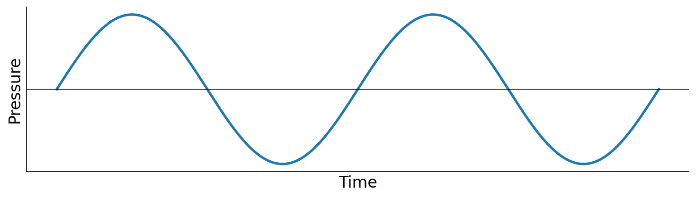

# 1.1 Waveforms: sound as a continuous function

```{prf:definition} Waveform
:label: def-waveform
A **waveform** (or, more generally, a continuous-time **signal**) is a function

$$x(t) : \mathbb{R} \to \mathbb{R},$$

mapping a real-valued time $t$ (seconds) to a real value $x(t)$.
```



To represent natural sound, $x(t)$ characterizes the air pressure at a fixed point in space over time. Pressure can be measured in physical units like Pascals, but in computer music we usually work with a unitless, normalized representation. Once a sound is recorded through a microphone (or otherwise scaled to a known range), we refer to the measured quantity as _amplitude_, and we linearly rescale it so that the recording system's full dynamic range maps to the interval $[-1, 1]$:


**A key aspect of this rescaling is that amplitude is _proportional_ to pressure**. Concretely, $x(t) = p(t) / p_{\max}$, where $p(t)$ is the underlying pressure signal (e.g., in Pascals) and $p_{\max}$ is the maximum pressure magnitude the recording system can represent. Unless otherwise specified, you should henceforth imagine the vertical axis of a waveform plot as a unitless amplitude in $[-1, 1]$: $+1$ is the maximum positive deviation the system can represent, $-1$ is the maximum negative deviation, and $0$ is silence.
