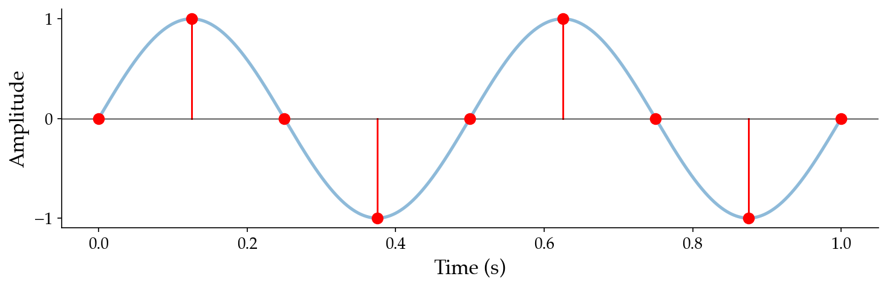
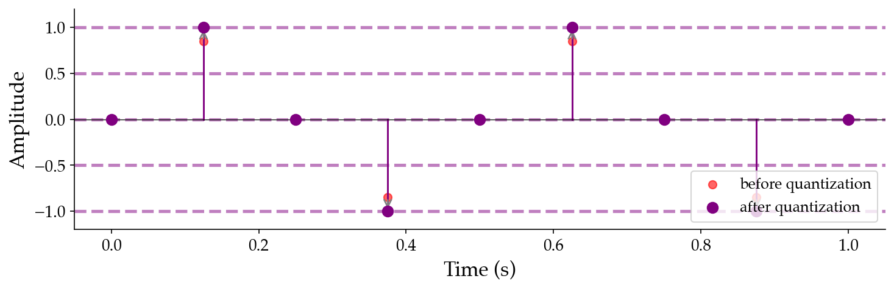

# 1.2 From analog to digital

Computers cannot store an analog signal $x(t)$ directly. The function takes real-valued inputs and produces real-valued outputs, so even a one-second clip carries an infinite amount of information. To bring sound into the digital world, we have to approximate $x(t)$ with a finite amount of data. The pipeline that performs this approximation is called _analog-to-digital conversion_ (ADC).

Transforming this _continuous sound_ to _digital audio_ involves discretizing both time and amplitude:

1. _Sampling_ in time: measure the signal amplitude at discrete, evenly spaced points known as _samples_.
2. _Quantizing_ in amplitude: latch each amplitude to its nearest neighbor in a finite set of amplitude values.

## Sampling

:::{margin} Why these rates?
44.1 kHz is the CD standard (1982); 48 kHz is the film and video standard. Both safely exceed twice the ~20 kHz upper limit of human hearing.
:::

:::{prf:definition} Sampling
:label: def-sampling
To _sample_ a continuous signal means to measure or evaluate it at a sequence of discrete time points, uniformly spaced at some interval $T_s$.
:::

We call $T_s$ the _sampling period_; its units are $\frac{\text{seconds}}{\text{sample}}$. Its reciprocal $f_s$, in units of $\frac{\text{samples}}{\text{second}}$, is called the _sample rate_, and the units already show us that $f_s = 1 / T_s$. Sample rates of 44,100 Hz and 48,000 Hz are common values of $f_s$ in practice; that is, **digital audio usually involves tens of thousands of samples per second**.

We index samples by an integer $n$ and adopt the convention

$$x[n] = x(n / f_s),$$

so $x[0]$ is the signal at time $t = 0$, $x[1]$ is its value at time $t = 1 / f_s$, and so on. Continuous-time signals get parentheses ($x(t)$); discrete-time sample sequences get square brackets ($x[n]$). This distinction will matter throughout the book. **You should grow very accustomed to converting between $\text{samples}$ and $\text{seconds}$** by dividing or multiplying by $f_s$.

:::{figure}

:::

After sampling, an infinite continuous function has been replaced by a finite ordered sequence of real numbers. Specifically, for some duration $T$, $x$ is now an array of $T \cdot f_s$ numbers, i.e., $x \in \mathbb{R}^{T \cdot f_s}$. But the values $x[n]$ are still real-valued, and we still cannot store real numbers exactly.

## Quantization

Sampling shrank time from a continuum to a finite grid; we have an analogous problem in amplitude. The values $x[n] \in \mathbb{R}$ are still real-valued, and a computer cannot store an arbitrary real number exactly.

:::{prf:definition} Quantization
:label: def-quantization
To _quantize_ a sample is to round its amplitude to a nearby element of a finite set.
:::

:::{margin} PCM
Pulse-code modulation has been the dominant digital audio format since the 1970s — lossless and trivially reversible.
:::

A common quantization convention in digital audio is _signed pulse-code modulation_ (PCM). We pick an integer _bit depth_ $b$ and define

$$\mathbb{Z}_b = \{-2^{b-1},\, -2^{b-1}+1,\, \ldots,\, 2^{b-1}-1\}$$

as the set of $2^b$ integers representable in $b$ bits using two's complement. We then map each amplitude $x[n] \in [-1, 1]$ to its quantized integer counterpart simply by

$$\hat{x}[n] = \lfloor (2^{b-1} - 1) \cdot x[n] \rfloor \in \mathbb{Z}_b.$$

For example, at $b = 16$ ("CD quality"), $\mathbb{Z}_{16}$ contains the $2^{16} = 65{,}536$ integers between $-32{,}768$ and $32{,}767$, and amplitudes of $\{-1.0, 0.0, 1.0\}$ correspond to integers $\{-32767, 0, 32767\}$ respectively.

:::{figure}

:::

Quantization is _lossy_: any two amplitudes that round to the same integer become indistinguishable in $\hat{x}[n]$. We will study and quantify the impacts of amplitude quantization when we study [sampling](TODO) in more detail.

A signal sampled at $f_s$ samples per second and quantized to $b$ bits per sample has a _bitrate_

$$\text{bitrate} \left[\frac{\text{bits}}{\text{seconds}}\right] = f_s \left[ \frac{\cancel{\text{samples}}}{\text{second}} \right] \cdot b \left[ \frac{\text{bits}}{\cancel{\text{sample}}} \right].$$

For so-called "CD-quality" audio ($f_s = 44{,}100$, $b = 16$), that is $44{,}100 \cdot 16 = 705{,}600 \left[\frac{\text{bits}}{\text{seconds}}\right]$. To get a more intuitive sense of file size, we can convert to kilobytes per second by chaining the standard relationships $8\,\text{bits} = 1\,\text{byte}$ and $1000\,\text{bytes} = 1\,\text{kilobyte}$:

$$705{,}600 \left[\frac{\cancel{\text{bits}}}{\text{seconds}}\right] \cdot \frac{1}{8} \left[\frac{\cancel{\text{byte}}}{\cancel{\text{bits}}}\right] \cdot \frac{1}{1000} \left[\frac{\text{kilobyte}}{\cancel{\text{byte}}}\right] \approx 88 \left[\frac{\text{kilobytes}}{\text{seconds}}\right].$$

A three-minute song therefore occupies roughly $88 \cdot 180 \approx 16$ megabytes on disk in this uncompressed form.

Most music is stored and reproduced in _stereo_, meaning there are two arrays or _channels_ (one for each of our ears) that allow us to perceive basic music spatialization. This doubles the storage size, resulting in $1{,}411{,}200 \left[\frac{\text{bits}}{\text{seconds}}\right]$ for stereo CD-quality audio. Note that, unless otherwise specified, we are henceforth referring to _mono_ (single channel) digital audio.

## Digital audio is just an array of numbers!

The punchline here is that, when stored on disk in formats like WAV, **digital audio is just an array of numbers together with the sample rate**.

When stored on disk, these numbers are usually integers. Why integers and not floats? A 32-bit floating-point number reserves a large fraction of its 32 bits for representing very large and very small magnitudes, i.e., values far outside $[-1, 1]$ that audio simply never uses. The audible range $[-1, 1]$ is a thin sliver of float's representable range, so most of those bits go to waste on every sample. Integer PCM, by contrast, packs every bit into uniform amplitude resolution _inside_ $[-1, 1]$, giving more precision per bit of storage.

In memory the convention flips. When you write computer music programs, you'll almost always manipulate $x[n]$ as a floating-point number in $[-1, 1]$ for arithmetic convenience: mixing, filtering, and synthesis all involve multiplication, addition, and transcendental functions that are awkward and lossy in integer space. **Quantization typically only enters the picture at the boundary**, when reading samples from a sound file or writing them out.
