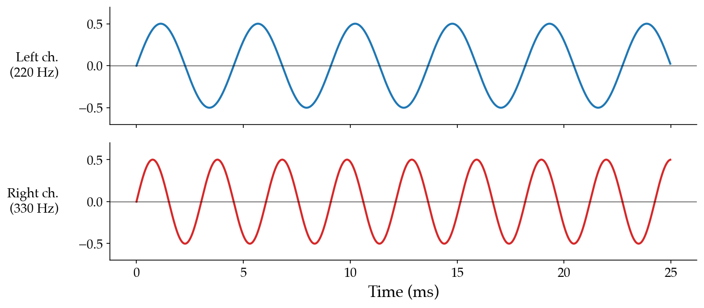

# 2.3 NumPy primer

Here we provide a basic overview of NumPy. For a more detailed tutorial, we point readers to the [official learning resources](https://numpy.org/learn/) and [the official quickstart tutorial](https://numpy.org/devdocs/user/quickstart.html).

## Creating arrays

A NumPy array (a `numpy.ndarray`) can be built from a Python list:

```python
import numpy as np

x = np.array([0.0, 0.5, 1.0, 0.5, 0.0, -0.5, -1.0, -0.5])
print(x.shape, x.dtype)   # (8,) float64
```

For audio buffers, we usually allocate by length instead, and optionally fill the initial buffer with some audio material.

```python
zeros = np.zeros(N)                    # a length-N silent buffer
noise = np.random.randn(N) * 0.01      # low amplitude white noise
```

`np.zeros(N)` is exactly silence: $x[n] = 0$ for all $n$. `np.random.randn(N) * 0.01` draws each sample independently from a standard normal distribution and scales it down by a factor of 100; the result is _white noise_ at a low amplitude.

```{warning}
**Headphone warning.** **Never do computer music programming using headphones. You could seriously damage your ears.** Our perception of volume in relation to amplitude is a tricky relationship: just because a signal is in $[-1, 1]$ does not mean it cannot damage your ears. Random and synthesized signals are the most dangerous signals you can play through headphones while learning. A one-character typo (`0.01` → `1.0`) can turn a quiet hiss into a deafening full-scale roar. **Use external speakers at low volume during development.**
```

```{admonition} 🔊 Listen
:class: note listen
<audio controls src="./assets/audio-noise.wav"></audio>

Two seconds of low-amplitude white noise generated by `np.random.randn(N) * 0.01`.
```

## Slicing arrays

If you are already familiar with Python list slicing, NumPy supports all the slicing patterns you would expect (they each return `np.ndarray`):

```python
x = np.arange(10)            # [0, 1, 2, ..., 9]
x[0]                         # 0
x[-1]                        # 9, the last element
x[2:5]                       # [2, 3, 4]
x[::2]                       # [0, 2, 4, 6, 8] - every other element
x[::-1]                      # [9, 8, 7, ..., 0] - reversed
```

For audio, slicing is how you grab a chunk of a recording. If `samples` is one second of audio at $f_s = 44{,}100$, then `samples[:22050]` is the first half-second and `samples[22050:]` is the second.

## Element-wise operations

Arithmetic on arrays is _element-wise_: every operation is applied independently to corresponding elements, with no Python-level loop in sight.

```python
x = np.array([1.0, 2.0, 3.0])
y = np.array([10.0, 20.0, 30.0])

x + y                # [11, 22, 33]
x * y                # [10, 40, 90]
x ** 2               # [1, 4, 9]
np.sqrt(x)           # [1.0, 1.414, 1.732]
```

A NumPy operation between an array and a scalar automatically _broadcasts_ the scalar across every element, i.e., it's equivalent to creating an array filled with the scalar value:

```python
x + 1                # [2, 3, 4]
0.5 * x              # [0.5, 1.0, 1.5]
```

This is exactly what happened when we wrote `2 * np.pi * f * (n / f_s)` above: all sample indices in array `n` are divided by sample rate `f_s` to convert them to times, and scalar `2 * np.pi * f` is multiplied into the entire `n / f_s` array in a single expression.

## Assignments and in-place operations

NumPy arrays can be modified after creation. You can assign to individual elements or to whole slices:

```python
samples = np.zeros(N)              # silent buffer of length N
samples[100] = 0.5                 # set a single sample
samples[:1000] = 1.0               # set the first 1000 samples to 1.0
samples[1000:2000] = np.sin(...)   # fill a slice with another array
```

NumPy also supports the compound arithmetic operators (`+=`, `-=`, `*=`, `/=`). On arrays these update the existing array **in place**, rather than allocating a new one. Compare the two ways to halve every sample of a buffer:

```python
# Out-of-place: allocates a new array; the original `samples` is unchanged
result = samples * 0.5

# In-place: updates `samples` directly, no new allocation
samples *= 0.5
```

The in-place form is usually faster and more memory-efficient, since there's no fresh array to allocate, fill, and (eventually) garbage-collect. Slice targets work too, which is handy for mixing additional material into part of an existing buffer:

```python
samples[:1000] += other            # mix `other` into the first 1000 samples in place
```

## Multi-channel arrays and stereo audio

Arrays in NumPy can be _multidimensional_. The arrays we've looked at so far are 1D _vectors_, but NumPy arrays can represent 2D _matrices_ or even higher-dimensional structures. Two helpful attributes characterize an array's layout:

- `arr.ndim`: the number of dimensions (1 for a vector, 2 for a matrix, ...).
- `arr.shape`: a tuple giving the size along each dimension.

```python
v = np.array([1.0, 2.0, 3.0])
v.ndim, v.shape                  # 1, (3,)

m = np.array([[1.0, 2.0], [3.0, 4.0], [5.0, 6.0]])
m.ndim, m.shape                  # 2, (3, 2)
```

Music is often rendered in _stereo_: two arrays of samples (often called _channels_), one for each ear, which allows for basic spatial effects. We represent a stereo signal as a 2D NumPy array.

```{margin} Time-major
Channel-major is the older DSP convention, but time-major slices more naturally by time — useful for windowing and frame-based processing.
```

There are two reasonable orderings: time-major `(num_samples, num_channels)` and channel-major `(num_channels, num_samples)`. We will adopt the time-major convention `(num_samples, num_channels)` throughout this book and in the Pyquist library below.

A small example: one second of stereo audio with a 220 Hz tone in the left channel and a 330 Hz tone in the right.

```python
f_s = 44100
N = f_s
n = np.arange(N)
t = n / f_s

left  = 0.5 * np.sin(2 * np.pi * 220 * t)   # shape (N,)
right = 0.5 * np.sin(2 * np.pi * 330 * t)   # shape (N,)

stereo = np.stack([left, right], axis=1)    # shape (N, 2)
print(stereo.shape)                         # (44100, 2)
```

`np.stack(..., axis=1)` glues two length-$N$ arrays side by side along a new axis at position 1, producing the time-major `(N, 2)` layout.



```{admonition} 🔊 Listen
:class: note listen
<audio controls src="./assets/audio-stereo-220-330.wav"></audio>

One second of stereo audio: 220 Hz in the left channel, 330 Hz in the right channel. (Best heard with stereo speakers or, cautiously, with headphones.)
```

Slicing a 2D array uses commas to address each axis:

```python
stereo[:, 0]             # the left channel only (1D, shape (N,))
stereo[:, 1]             # the right channel only
stereo[:1000, :]         # the first 1000 samples of both channels (2D, shape (1000, 2))
stereo[:1000]            # equivalent shorthand
```

## Broadcasting

The `np.stack` trick above works, but a more elegant pattern scales up to more channels. NumPy's [_broadcasting_](https://numpy.org/doc/stable/user/basics.broadcasting.html) rules let us combine arrays of different shapes, provided the shapes are compatible.

An example in music synthesis: let's say we wanted to synthesize stereo audio consisting of two sine waves with a different frequency in the left and right channel. To do this, we implicitly want to evaluate sine at all points in time and at two different frequencies, i.e., a nested loop. Using NumPy's broadcasting rules, we can concisely represent these types of multi-dimensional operations:

```python
# In vanilla Python as a nested loop
freqs = [220.0, 330.0]
stereo = [[0.0, 0.0]] * N
for n in range(N):
    t = n / f_s
    for c in range(2):
        stereo[n, c] = 0.5 * math.sin(2 * np.pi * freqs[c] * t)

# As vectorized / broadcasted operations in NumPy
t = np.arange(N) / f_s
freqs = np.array(freqs)
# t[:, np.newaxis] has shape (N, 1)
# freqs            has shape (2,)
# Their product broadcasts to shape (N, 2)
stereo = 0.5 * np.sin(2 * np.pi * freqs * t[:, np.newaxis])
```

`np.newaxis` adds an axis of length 1, reshaping `t` from `(N,)` to `(N, 1)`. NumPy then aligns the two shapes from the right (`(N, 1)` vs. `(2,)`), and where one shape has a `1`, it stretches (broadcasts) that array along that axis. The result has shape `(N, 2)`, identical to the `np.stack` version above.

To go from stereo back to mono, average across the channel axis:

```python
mono = stereo.mean(axis=1)        # shape (N,)
```

```{admonition} 🔊 Listen
:class: note listen
<audio controls src="./assets/audio-mono-220-330-mix.wav"></audio>

The same stereo example, downmixed to mono by averaging the two channels. Both pitches are present in a single channel.
```

```{tip}
**If you didn't completely follow this, don't worry**. Mastering multidimensional operations and broadcasting rules in NumPy requires practice, and you will naturally gain experience throughout this course.
```
