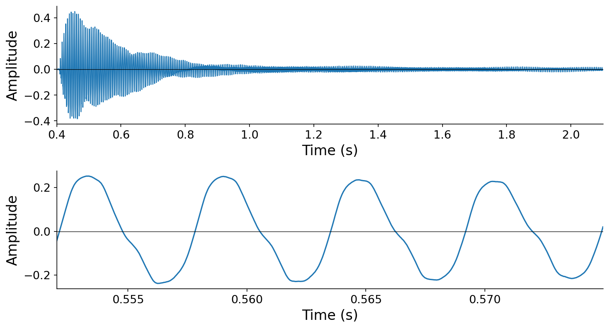
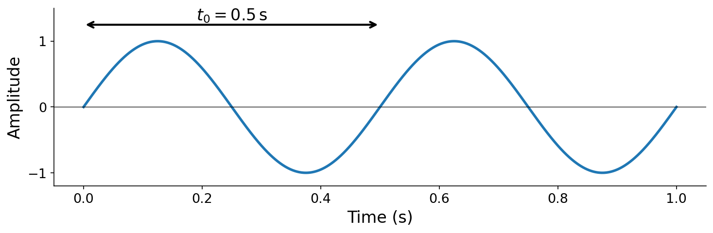
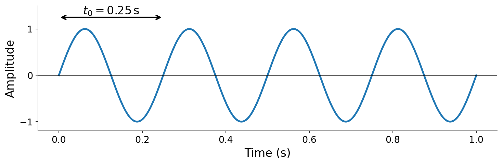

# 3.0 Periodicity, period, and frequency

**Periodicity is the foundation of musical sound.** Sounds that we recognize as having a definite "pitch" — a plucked guitar string, a sustained vowel, a flute tone — are periodic in nature. Their waveforms repeat, more or less, at a regular rate. Consider what happens when you pluck a guitar string: the string oscillates back and forth, and the resulting air pressure variations create a waveform whose shape recurs over and over:

:::{audio}
[Classical guitar F3, plucked](./assets/154030__carlos_vaquero__classical-guitar-f-3-plucked-non-vibrato.wav)

Classical guitar, F3, plucked without vibrato. [154030](https://freesound.org/s/154030/) by Carlos_Vaquero, License: [Attribution NonCommercial 4.0](https://creativecommons.org/licenses/by-nc/4.0/).
:::

:::{figure}

A plucked guitar string (F3). Top: the pluck and decay over roughly 1.7 seconds. Bottom: zoomed in to about 23 milliseconds, where the quasi-periodic repetition of the waveform shape is clearly visible.
:::

The waveform in the zoomed view above is not _perfectly_ repetitive — it's what acousticians call _quasi-periodic_, meaning the shape changes slowly over time as the note decays. But over short time scales, the repetition is strikingly regular.

## Periodicity

Following {cite}`mcfee2023digital`, we can formalize this observation. A continuous signal $x(t)$ is {vocab}`periodic` with period $T$ if

$$x(t + T) = x(t) \quad \text{for all } t \in \mathbb{R}.$$

The {vocab}`fundamental period` $t_0$ is the smallest strictly positive $T$ satisfying this condition.

:::{prf:definition} Periodicity
:label: def-periodicity
A signal $x(t) : \mathbb{R} \to \mathbb{R}$ is _periodic_ if there exists a finite $T > 0$ such that $x(t + T) = x(t)$ for all $t \in \mathbb{R}$. The _fundamental period_ $t_0$ is the smallest such $T$.
:::

If $t_0$ is a period, then all integer multiples of $t_0$ must also be periods:

$$x(t) = x(t + t_0) = x(t + 2 \cdot t_0) = x(t + 3 \cdot t_0) = \ldots$$

More generally, $x(t) = x(t + k \cdot t_0)$ for any $k \in \mathbb{Z}$.

## Frequency

One full repetition of a periodic waveform is called a _cycle_ (we will use _cycle_ and _period_ interchangeably). The fundamental period $t_0$ tells us how long one cycle takes, in units of ${unit}`seconds,cycle`$. Its reciprocal is {vocab}`frequency` — how many cycles fit in one second, in units of ${unit}`cycles,second`$:

$$f_0 = \frac{1}{t_0}.$$

This relationship follows directly from the units: if $t_0$ has units ${unit}`seconds,cycle`$, then $1/t_0$ has units ${unit}`cycles,second`$.

:::{prf:definition} Fundamental frequency
:label: def-fundamental-frequency
The _fundamental frequency_ of a periodic signal $x(t)$ with fundamental period $t_0$ is $f_0 = 1 / t_0$.
:::

Frequency is measured in {vocab}`Hertz` (Hz), where 1 Hz = 1 ${unit}`cycle,second`$.

:::{figure}

A waveform with $t_0 = 0.5\,\mathrm{s}$ has $f_0 = 2\,\mathrm{Hz}$ (top). Compressing the same shape into a quarter of a second gives $t_0 = 0.25\,\mathrm{s}$ and $f_0 = 4\,\mathrm{Hz}$ (bottom).
:::

**Frequency is the property most strongly associated with our perception of musical _pitch_**: higher frequencies sound higher in pitch, lower frequencies sound lower. If you've studied music, each line on a musical staff corresponds to a specific fundamental frequency. We will have more to say about pitch perception in later chapters.
