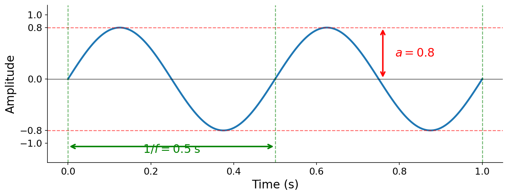
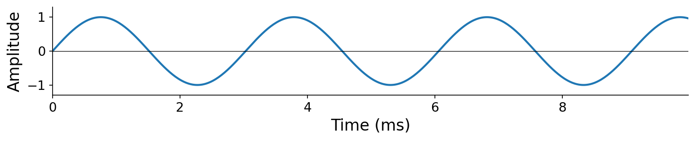
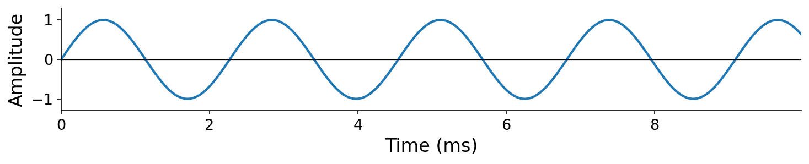
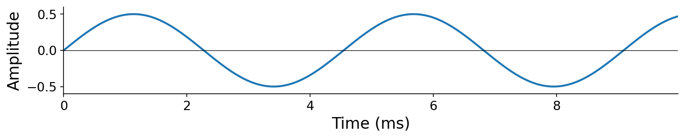
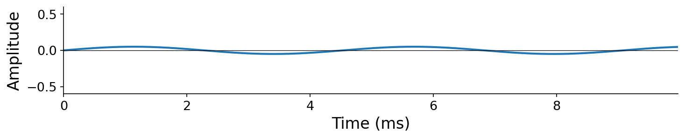
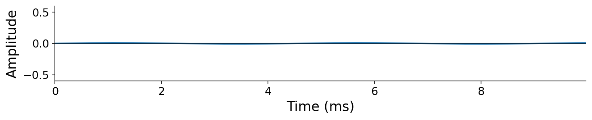
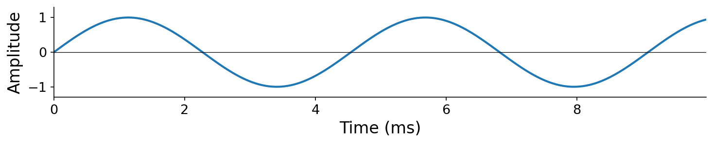
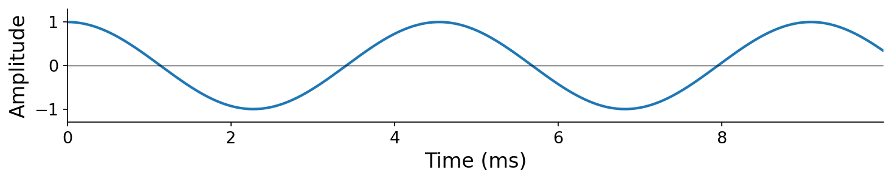
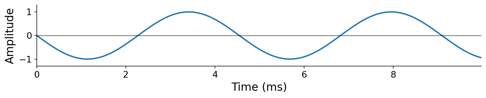

# 3.1 The basic sinusoid

The most elementary periodic function is the {vocab}`basic sinusoid`:

$$x(t) = a \sin(2 \pi f t + \phi).$$

It sounds like a "pure tone" — a smooth, featureless hum with no timbral complexity. As we'll see later in this chapter, the basic sinusoid is a fundamental building block: **all periodic sound, no matter how complex, can be expressed as a sum of basic sinusoids**.

The basic sinusoid has three parameters: {vocab}`frequency` $f$, {vocab}`amplitude` $a$, and {vocab}`initial phase` $\phi$.

:::{figure}

The sinusoid $x(t) = 0.8 \sin(2\pi \cdot 2 \, t)$ with $a = 0.8$, $f = 2$ Hz, $\phi = 0$. The dashed red lines mark the amplitude bounds $\pm a$, and the green dashed lines and arrow mark the period boundaries at $1/f$.
:::

## Frequency and angular frequency

**Frequency determines pitch.** Listen to pure tones at three different frequencies — each sounds higher in pitch than the last:

:::audio-figure
{audio}`220 Hz sine <./assets/audio-sine-220.wav>` 

{audio}`330 Hz sine <./assets/audio-sine-330.wav>` 

{audio}`440 Hz sine <./assets/audio-sine-440.wav>` 

Pure tones at 220, 330, and 440 Hz. Higher frequency means more cycles per second and a higher perceived pitch.
:::

Why does the basic sinusoid with parameter $f$ complete exactly $f$ cycles per second? We can reason about this from the units, building up from what we know about $\sin$.

Recall from trigonometry that $\sin$ repeats itself with period $2\pi$ {unit}`radians,cycle`. In our basic sinusoid, at $t = 1$ second, the argument to $\sin$ will have accumulated $2\pi f$ radians. This gives us the {vocab}`angular frequency`:

$$\omega = 2\pi f$$

in units of {unit}`radians,second`.

To convert back to frequency in Hertz, we divide by $2\pi$ {unit}`radians,cycle`:

$$f = \frac{\omega}{2\pi}$$

in units of {unit}`cycles,second`.

:::{prf:definition} Angular frequency
:label: def-angular-frequency
The _angular frequency_ of a sinusoid with frequency $f$ {unit}`cycles,second` is $\omega = 2\pi f$ {unit}`radians,second`. Equivalently, $f = \omega / (2\pi)$.
:::

Angular frequency lets us write the basic sinusoid more compactly as $x(t) = a\sin(\omega t + \phi)$. You will see both forms throughout this book — familiarize yourself with converting between $f$ and $\omega$.

:::{note}
**A more formal proof that the basic sinusoid has period $1/f$.**

For the mathematically inclined, we can derive this directly. Recall that $\sin(x) = \sin(x + 2\pi)$:

$$
\begin{aligned}
x(t) &= a \sin(2\pi f t + \phi) \\
      &= a \sin(2\pi f t + \phi + 2\pi) \\
      &= a \sin(2\pi [ft + 1] + \phi) \\
      &= a \sin(2\pi f [t + 1/f] + \phi) \\
      &= x(t + 1/f).
\end{aligned}
$$

Therefore $x(t) = x(t + 1/f)$, confirming that $x(t)$ is periodic with period $1/f$. This holds regardless of the values of $a$ and $\phi$.
:::

## Amplitude

Amplitude is a comparatively straightforward property. Recall from trigonometry that $\sin(x) \in [-1, 1]$, so $\sin$ has a maximum amplitude deviation of 1. Accordingly, $a \sin(x) \in [-a, a]$, meaning our basic sinusoid has an amplitude of $a$.

**Amplitude determines loudness.** Listen to the same 220 Hz tone at three different amplitudes:

:::audio-figure
{audio}`220 Hz sine, amplitude 0.5 <./assets/audio-sine-amp-0p5.wav>` 

{audio}`220 Hz sine, amplitude 0.05 <./assets/audio-sine-amp-0p05.wav>` 

{audio}`220 Hz sine, amplitude 0.005 <./assets/audio-sine-amp-0p005.wav>` 

The same frequency (220 Hz) at three amplitudes. The relationship between amplitude and our perception of "volume" is more nuanced than it appears here — we will formalize this when we study decibels.
:::

## Initial phase and instantaneous phase

At a high level, {vocab}`phase` characterizes our position within a cycle. In the basic sinusoid, phase appears in two forms:

1. The {vocab}`initial phase` $\phi$ — a constant offset in radians that shifts the waveform's starting point.
1. The {vocab}`instantaneous phase` $\theta(t) = 2\pi f t + \phi = \omega t + \phi$ — the total phase of the sinusoid at time $t$, in radians.

The instantaneous phase at time $t$ equals the radians elapsed based on angular frequency $\omega$ {unit}`radians,second` plus the initial offset $\phi$ {unit}`radians`. We can rewrite the basic sinusoid as $x(t) = a \sin(\theta(t))$.

:::{prf:example} Instantaneous phase
:label: ex-instantaneous-phase
Consider our working example: $f = 2$ Hz, $\phi = \pi/2$. The angular frequency is $\omega = 4\pi$ {unit}`radians,second`, so $\theta(t) = 4\pi t + \pi/2$. At a few specific times:

- $\theta(0) = \pi/2$ radians (the initial phase)
- $\theta(0.5) = 4\pi \cdot 0.5 + \pi/2 = 5\pi/2$ radians (one full period later)
- $\theta(1) = 4\pi \cdot 1 + \pi/2 = 9\pi/2$ radians (two full periods later)

Notice that $\theta$ increases by $2\pi$ radians each period — exactly one full cycle.
:::

**Our perception of phase differs from that of frequency and amplitude.** Listen to a 220 Hz tone at three different initial phases:

:::audio-figure
{audio}`Phase = 0 <./assets/audio-sine-phase-0.wav>` 

{audio}`Phase = pi/2 <./assets/audio-sine-phase-1.wav>` 

{audio}`Phase = pi <./assets/audio-sine-phase-2.wav>` 

The same frequency (220 Hz) and amplitude at three initial phases. The waveforms are visually shifted in time, but they sound nearly identical.
:::

Aside from slightly different "clicks" at the onset and offset of the waveform (caused by the signal's value at the very first and last sample), **these tones sound essentially the same**. This is a general property of human hearing: we are largely insensitive to the absolute phase of a sound. This perceptual insensitivity will become important when we discuss additive synthesis below.
