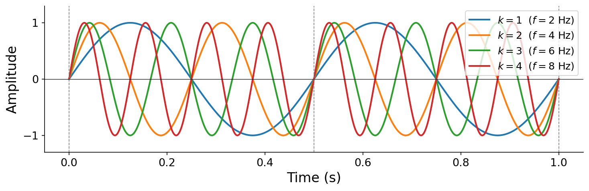
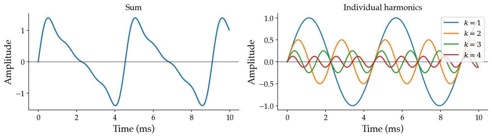
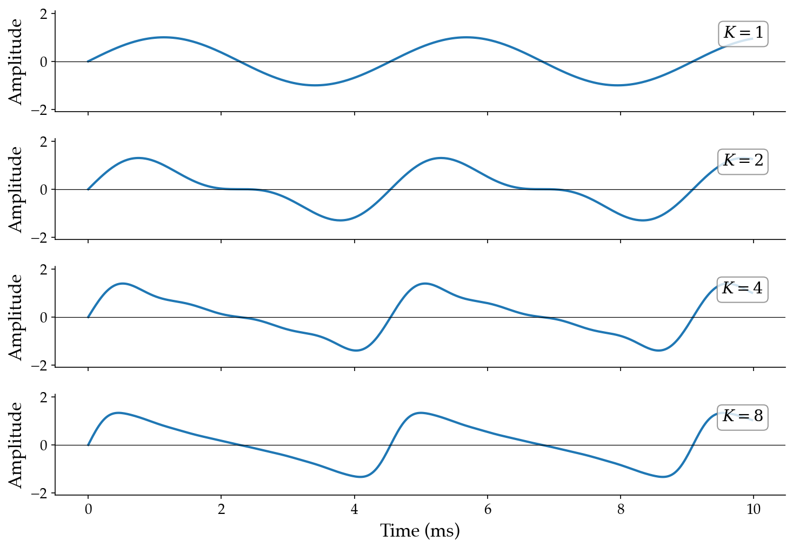

# 3.2 Additive synthesis

## The Fourier series

We claimed above that all periodic sound can be expressed as a sum of basic sinusoids. This is a profound result from mathematics known as the {vocab}`Fourier series`:

:::{prf:definition} Fourier series
:label: def-fourier-series
If $x(t)$ is periodic with fundamental period $t_0$ and fundamental frequency $f_0 = 1/t_0$, then $x(t)$ can be represented as

$$x(t) = a_0 + \sum_{k=1}^{K} a_k \sin(2\pi [k \cdot f_0] \, t + \phi_k),$$

where the frequencies are constrained to integer multiples of $f_0$. For well-behaved periodic signals (continuous or piecewise smooth — which includes all physically realizable sounds), this sum converges to $x(t)$ as $K \to \infty$.
:::

The proof is beyond the scope of this book, but the implications are central to everything that follows. Some periodic signals require infinitely many terms (e.g., a "perfect" square wave), while others are exact with finitely many (e.g., a sine wave itself is a Fourier series with $K = 1$). The key constraint is that the frequencies in the sum are _not_ arbitrary — they must be integer multiples of the fundamental frequency $f_0$. The $k$-th sinusoidal component has frequency $k \cdot f_0$.

## Harmonics

:::{prf:definition} Harmonic
:label: def-harmonic
In the Fourier series expansion, each sinusoidal component is called a _harmonic_. Harmonic $k$ has frequency $f_k = k \cdot f_0$, amplitude $a_k$, and initial phase $\phi_k$.
:::

It follows that the first harmonic ($k = 1$) has frequency equal to the fundamental $f_0$, the second harmonic ($k = 2$) has frequency $2 f_0$, the third has $3 f_0$, and so on.

:::{figure}

The first four harmonics of a $f_0 = 2$ Hz fundamental, all at unit amplitude. Each harmonic $k$ completes exactly $k$ cycles per fundamental period. Notice that all harmonics pass through zero together at the fundamental period boundaries (dashed lines) — this is a consequence of the integer frequency constraint.
:::

:::{note}
If you have studied music before, you may have heard "harmonic" and "overtone" used somewhat interchangeably. Despite common conflation, these are not equivalent concepts — technically, an [overtone](https://en.wikipedia.org/wiki/Overtone) can take on arbitrary frequencies above the fundamental, not necessarily integer multiples. In this book, we use precise terminology: harmonic $k$ has frequency $k \cdot f_0$.
:::

## Additive synthesis

In computer music, the Fourier series serves not only as a mathematical expansion but also as a synthesis technique. {vocab}`Additive synthesis` builds complex tones by summing sinusoidal harmonics:

:::{prf:definition} Additive synthesis
:label: def-additive-synthesis
$$x(t) = \sum_{k=1}^{K} a_k \sin(2\pi [k \cdot f_0] \, t + \phi_k)$$
:::

Though the constant $a_0$ is required for mathematical completeness of the Fourier series, it represents a static offset that is not relevant to our perception of sound, so we ignore it henceforth.

:::{note}
You can think of $x(t) = a_0$ as a basic sinusoid at $0$ Hz — the "zeroth harmonic." We will revisit this when we study the frequency domain.
:::

## Synthesis parameters

Additive synthesis has a few parameters:

- $K$: the highest harmonic number present
- $f_0$: the fundamental frequency
- $\mathbf{a} = [a_1, a_2, \ldots, a_K]$: the amplitude coefficients
- $\boldsymbol{\phi} = [\phi_1, \phi_2, \ldots, \phi_K]$: the initial phase coefficients

:::{figure}

Additive synthesis with $K = 4$, $f_0 = 220$ Hz, $\mathbf{a} = [1, 1/2, 1/4, 1/8]$. Left: the resulting sum. Right: each harmonic plotted individually — note how each successive harmonic has higher frequency and lower amplitude.
:::

Let's examine how we perceive each parameter. We'll use a default tone with $K = 4$, $f_0 = 220$ Hz, $\mathbf{a} = [1, 1/2, 1/4, 1/8]$, and $\boldsymbol{\phi} = [0, 0, 0, 0]$:

:::{audio}
[Default additive tone](./assets/audio-additive-default.wav)

Additive synthesis with $K = 4$, $f_0 = 220$ Hz, geometric amplitude decay.
:::

**Varying $f_0$ (pitch)**: Changing the fundamental frequency shifts all harmonics proportionally and changes the perceived pitch. These four examples all use the same amplitude pattern $\mathbf{a} = [1, 1/2, 1/4, 1/8]$ but different random fundamental frequencies between 220 and 440 Hz:

:::{audio-list}
{audio}`Random f0, example 1 <./assets/audio-additive-f0-0.wav>`

{audio}`Random f0, example 2 <./assets/audio-additive-f0-1.wav>`

{audio}`Random f0, example 3 <./assets/audio-additive-f0-2.wav>`

{audio}`Random f0, example 4 <./assets/audio-additive-f0-3.wav>`

Four random fundamental frequencies with the same harmonic amplitude pattern — perceived as different pitches.
:::

**Varying amplitudes $\mathbf{a}$ (timbre)**: Changing the relative amplitudes of the harmonics changes the {vocab}`timbre` — the tonal "color" of a sound. All four examples below have the same pitch ($f_0 = 220$ Hz) and the same number of harmonics ($K = 4$), but different random amplitude patterns produce perceptibly different timbres:

:::{audio-list}
{audio}`Random timbre 1 <./assets/audio-additive-timbre-0.wav>`

{audio}`Random timbre 2 <./assets/audio-additive-timbre-1.wav>`

{audio}`Random timbre 3 <./assets/audio-additive-timbre-2.wav>`

{audio}`Random timbre 4 <./assets/audio-additive-timbre-3.wav>`

Four random amplitude patterns at the same pitch — perceived as different timbres.
:::

**Varying phases $\boldsymbol{\phi}$**: Consistent with what we observed for the basic sinusoid, changing the initial phases has very little perceptible effect. The following four examples use the same amplitudes $\mathbf{a} = [1, 1/2, 1/4, 1/8]$ but different random phases:

:::{audio-list}
{audio}`Random phase 1 <./assets/audio-additive-phase-0.wav>`

{audio}`Random phase 2 <./assets/audio-additive-phase-1.wav>`

{audio}`Random phase 3 <./assets/audio-additive-phase-2.wav>`

{audio}`Random phase 4 <./assets/audio-additive-phase-3.wav>`

Four random phase patterns with the same amplitudes — sound essentially identical.
:::

These should sound essentially identical, confirming that **phase has negligible perceptual effect in additive synthesis**. The amplitude coefficients $\mathbf{a}$ are what matter.

**Varying $K$ (number of harmonics)**: Adding more harmonics produces a richer, brighter tone. With $K = 1$ we hear a bare sine wave; as $K$ grows, the timbre gains complexity:

:::{audio-board}
{audio}`K = 1 <./assets/audio-additive-K1.wav>`

{audio}`K = 2 <./assets/audio-additive-K2.wav>`

{audio}`K = 4 <./assets/audio-additive-K4.wav>`

{audio}`K = 8 <./assets/audio-additive-K8.wav>`

Additive synthesis at $f_0 = 220$ Hz with $K \in \{1, 2, 4, 8\}$ harmonics (amplitude pattern $a_k = 1/2^{k-1}$). As $K$ increases, the waveform shape grows more complex and the timbre becomes richer.
:::

The full code for these examples is in [code/additive.py](./code/additive.py).
