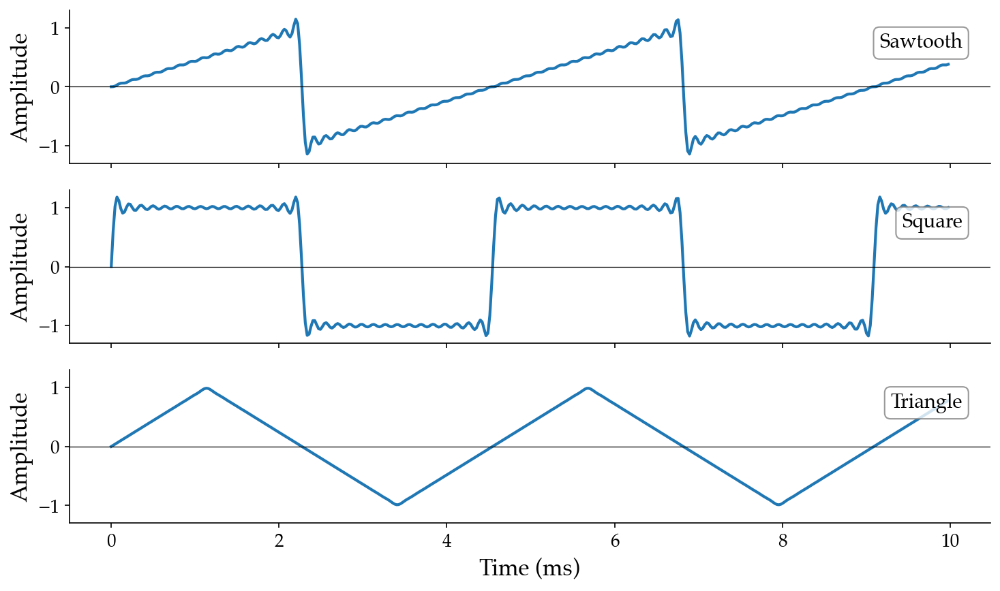

# 3.3 Basic waveform shapes

If you've played with synthesizers before, you may have encountered periodic waveform _shapes_ besides sine waves: sawtooth, square, and triangle waves. These are ubiquitous in synthesis, and each has a distinctive sonic character.

Because these are all periodic, the Fourier series guarantees that they live within the parameter space of additive synthesis — each is defined by a particular pattern of harmonic amplitudes. The key idea for each waveform is **how the harmonic amplitudes scale with harmonic number $k$**:

**Sawtooth wave.** A bright, buzzy tone. All harmonics are present, and the amplitudes fall off as $1/k$. This slow decay means upper harmonics remain strong, giving the sawtooth its characteristic brightness.

**Square wave.** A hollow, clarinet-like tone. Only _odd_ harmonics are present ($k = 1, 3, 5, \ldots$), and the amplitudes also fall off as $1/k$. The missing even harmonics give the square wave its hollow character.

**Triangle wave.** A softer, more muted tone. Like the square, only odd harmonics are present, but the amplitudes decrease much faster — as $1/k^2$. This rapid decay makes the triangle the smoothest of the three.

:::{note}
The exact Fourier coefficients include constant factors and signs that affect scaling and orientation. For the sawtooth: $a_k = 2(-1)^{k+1} / (\pi k)$. For the square: $a_k = 4/(\pi k)$ for odd $k$, $0$ for even. For the triangle: $a_k = 8(-1)^{(k-1)/2}/(\pi^2 k^2)$ for odd $k$, $0$ for even. The proportional relationships ($1/k$ vs. $1/k^2$, all harmonics vs. odd only) are more important to learn than these specifics.
:::

:::{audio-board}
{audio}`Sawtooth wave <./assets/audio-sawtooth.wav>`

{audio}`Square wave <./assets/audio-square.wav>`

{audio}`Triangle wave <./assets/audio-triangle.wav>`

Sawtooth, square, and triangle waves at 220 Hz, built from $K = 32$ harmonics. The waveform shapes emerge from the particular amplitude patterns of their harmonics.
:::

Notice the sonic differences: the sawtooth is the brightest (strongest upper harmonics), the square has a distinctive hollow quality (missing even harmonics), and the triangle is the smoothest (harmonics die off quickly). These perceptual differences arise entirely from the amplitude coefficients.

The full code is in [code/waveforms.py](./code/waveforms.py).
