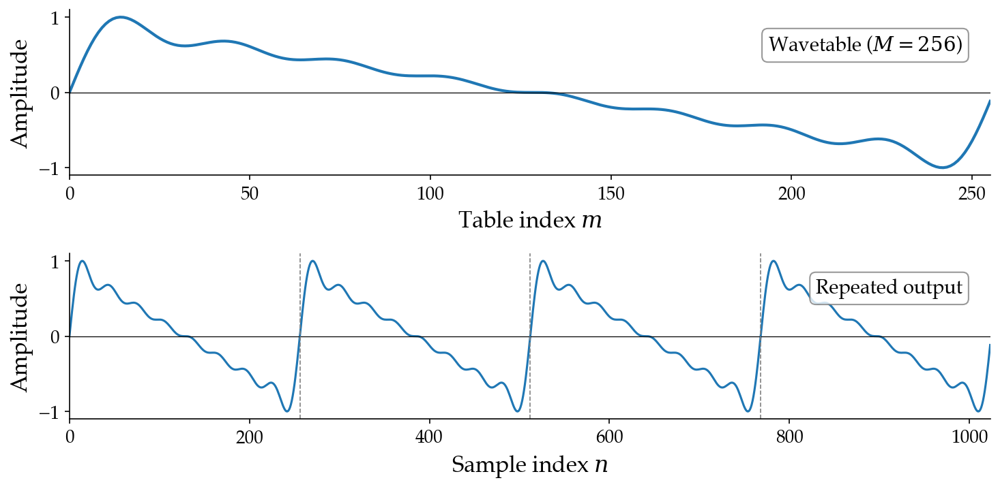

# 3.4 Wavetable synthesis

## An algorithmic perspective

We've now established additive synthesis as a powerful technique grounded in the Fourier series. But how efficient is it computationally? Let's think about this from a computer science perspective.

To synthesize $N$ samples of a tone with $K$ harmonics, we compute:

$$x[n] = \sum_{k=1}^{K} a_k \sin(2\pi k f_0 \, [n / f_s] + \phi_k) \quad \text{for } n = 0, 1, \ldots, N-1.$$

This requires $K$ calls to `sin` per sample, or $K \cdot N$ total evaluations. For one second of audio at $f_s = 44{,}100$ with $K = 32$ harmonics, that's $32 \times 44{,}100 \approx 1.4$ million `sin` evaluations. Even if a modern computer could keep up with this in real time, what if you need to run many synthesizers in parallel (e.g., in a DAW), or what if you're working on hardware with limited compute?

What structure can we exploit to make additive synthesis more efficient? Here's the key insight: the output of additive synthesis is periodic. The waveform repeats every $t_0 = 1/f_0$ seconds, or equivalently every $f_s / f_0$ samples. **So we only need to compute one cycle of the waveform, then cache the result and repeat it.**

## Building the wavetable

This insight leads to {vocab}`wavetable synthesis`. The first step is to compute a single cycle of the waveform — a {vocab}`wavetable` — and store it as an array of $M$ samples:

$$\texttt{table}[m] = \sum_{k=1}^{K} a_k \sin\!\left(2\pi k \cdot \frac{m}{M}\right) \quad \text{for } m = 0, 1, \ldots, M - 1.$$

Here $m / M$ maps the table index to the range $[0, 1)$, covering exactly one period. In code:

```python
def build_wavetable(a: list[float], M: int = 2048) -> np.ndarray:
    K = len(a)
    a = np.array(a)
    k = 1 + np.arange(K)
    m = np.arange(M)
    # Broadcasting: (M, 1) * (K,) -> (M, K)
    table = (a * np.sin(2 * np.pi * k * m[:, np.newaxis] / M)).sum(axis=1)
    return table
```

Building the table costs $O(K \cdot M)$ operations, but it runs only _once_ for a given waveform shape.

## Reading the wavetable

To produce output at frequency $f_0$, we need to read from the table at the right rate. The table spans one period, and we want the output to complete $f_0$ cycles per second. Working from the units:

- The table has $M$ ${unit}`indices,cycle`$.
- We want $f_0$ ${unit}`cycles,second`$.
- The output sample rate is $f_s$ ${unit}`samples,second`$.

The {vocab}`phase increment` — how far we advance through the table per output sample — is:

$$\Delta = f_0 \cdot \frac{M}{f_s} \quad \left[\frac{\text{table indices}}{\text{output sample}}\right].$$

After $n$ output samples, we've accumulated a phase of $n \cdot \Delta$ table indices. To read the table, we wrap this phase modulo $M$:

$$x[n] = \texttt{table}\!\left[\; (n \cdot \Delta) \bmod M \;\right].$$

:::{figure}


Top: a single-cycle wavetable of $M = 256$ indices. Bottom: the output signal produced by repeating this table. The dashed lines mark cycle boundaries.
:::

## Nearest-neighbor lookup

The simplest implementation truncates $n \cdot \Delta$ to an integer before indexing:

```python
def wavetable_naive(
    table: np.ndarray, f_0: float, f_s: int, N: int,
) -> pq.Audio:
    M = len(table)
    phase_inc = f_0 * M / f_s       # delta
    phase = np.arange(N) * phase_inc
    indices = phase.astype(int) % M  # truncate to nearest table entry
    return pq.Audio(table[indices], sample_rate=f_s)
```

This works, but when $\Delta$ is not an integer (which is common — e.g., $f_0 = 440$, $M = 2048$, $f_s = 44{,}100$ gives $\Delta \approx 20.43$), we always round down to the nearest table entry, introducing quantization error. The effect is especially audible with a small table. Compare an exact sine wave to nearest-neighbor wavetable lookup with $M = 8$:

:::{audio-list}
{audio}`Exact sine wave at 440 Hz <./assets/audio-wt-exact.wav>`

{audio}`Nearest-neighbor wavetable, M = 8 <./assets/audio-wt-naive-8.wav>`

Exact vs. nearest-neighbor wavetable sine at 440 Hz. The coarse table produces audible stepping artifacts.
:::

## Linear interpolation

A better approach is to _interpolate_ between adjacent table entries. Given a fractional index $p = n \cdot \Delta$, we split it into an integer part $\lfloor p \rfloor$ and a fractional part $\alpha = p - \lfloor p \rfloor$, then blend:

$$x[n] = (1 - \alpha) \cdot \texttt{table}\!\left[\lfloor p \rfloor \bmod M\right] + \alpha \cdot \texttt{table}\!\left[(\lfloor p \rfloor + 1) \bmod M\right].$$

In code:

```python
def wavetable_interp(
    table: np.ndarray, f_0: float, f_s: int, N: int,
) -> pq.Audio:
    M = len(table)
    phase_inc = f_0 * M / f_s
    phase = np.arange(N) * phase_inc
    m = phase.astype(int)
    alpha = phase - m
    x = (1 - alpha) * table[m % M] + alpha * table[(m + 1) % M]
    return pq.Audio(x, sample_rate=f_s)
```

Linear interpolation adds negligible computational cost (a multiply and an add per sample) but dramatically reduces the error, especially when $M$ is small. Compare the same $M = 8$ table with interpolation:

:::{audio-list}
{audio}`Exact sine wave at 440 Hz <./assets/audio-wt-exact.wav>`

{audio}`Interpolated wavetable, M = 8 <./assets/audio-wt-interp-8.wav>`

Exact vs. linear interpolation wavetable sine at 440 Hz. Even with only 8 table entries, interpolation produces a much smoother result.
:::

In practice, most wavetable synthesizers use at least linear interpolation; some use higher-order schemes (cubic, sinc) for even better quality.

:::{audio}
[Wavetable sawtooth](./assets/audio-wavetable-saw-interp.wav)

Sawtooth wave at 220 Hz synthesized via wavetable lookup with linear interpolation, using the same $K = 32$ harmonic recipe.
:::

## Complexity

Direct additive synthesis costs $O(K \cdot N)$ to synthesize $N$ samples: $K$ `sin` evaluations per sample. Wavetable synthesis costs $O(K \cdot M)$ to build the table once, then $O(N)$ to read it — for a total of $O(K \cdot M + N)$, where $M << N$. Since $M$ is a fixed constant (typically 2048 or 4096), the table-building step is a one-time cost that does not grow with the output length.

The key implication: **once the wavetable is computed, the per-sample cost of synthesis is $O(1)$ regardless of how many harmonics $K$ went into the table**. A 4-harmonic triangle wave and a 64-harmonic sawtooth are equally cheap to synthesize once their tables are built. This is in stark contrast to direct additive synthesis, where doubling $K$ doubles the cost.

:::{tip}
On a modern machine with NumPy, the wavetable version of a 32-harmonic sawtooth runs roughly 20–40x faster than the direct additive computation. The speedup grows with $K$: the more harmonics in your recipe, the more work you avoid by precomputing the table.
:::

The full implementation and timing comparison is in [code/wavetable.py](./code/wavetable.py).
