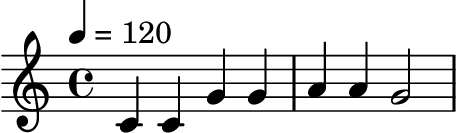
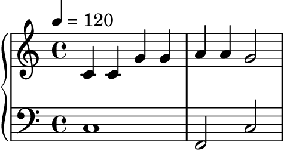
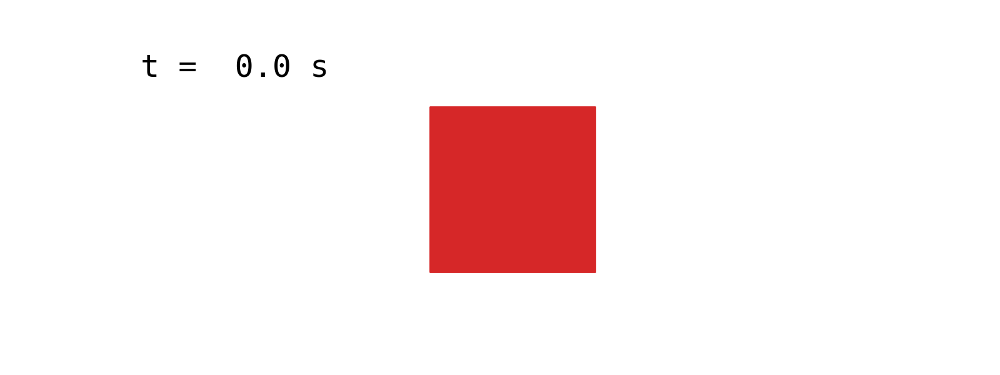

# 4.0 Scores

If you've studied music before, you're likely familiar with musical scores written in standard Western notation:

:::{figure}


The first phrase of "Twinkle, Twinkle, Little Star", consisting of seven _notes_ with musical pitches C C G G A A G. Written in standard Western notation: quarter notes in 4/4 time, treble clef. The tempo marking ♩ = 120 (120 quarter-note beats per minute) means each quarter note lasts half a second.
:::

:::{audio}
[The melody above, synthesized](./assets/audio-twinkle-melody.wav)

The same melody, synthesized so you can hear it without reading notation.
:::

:::{note}
**You will not need to read music notation in this class.** The staff above is included only for demonstration, and to ground the discussion for those who _have_ studied music notation. Everything we do with scores will be expressed in code.
:::

Standard notation was designed for human music comprehension. But here we're studying computer music, so we should ask: how should we represent a score on a _computer_?

Across many musical practices and cultures (including but not limited to Western music), musical scores can be characterized by a set of {vocab}`events`: each occurring at a specific point in time and carrying parameters that describe it {cite}`dannenberg2024intro`. This is exactly how Pyquist represents a score. A {vocab}`score` is a list of {vocab}`event`s, where each event is a pair of a `time` and a dictionary of keyword arguments.

:::{margin}
Pyquist's design of `pq.Score` was heavily inspired by Roger Dannenberg's Nyquist {cite}`dannenberg1997implementation`.
:::

A natural way to translate Western notation into a `pq.Score` is to map each _note_ into one event. Doing so for the melody above:

```python
import pyquist as pq

melody = pq.Score([
    (0.0, {"pitch": "C4", "duration": 0.5}),
    (0.5, {"pitch": "C4", "duration": 0.5}),
    (1.0, {"pitch": "G4", "duration": 0.5}),
    (1.5, {"pitch": "G4", "duration": 0.5}),
    (2.0, {"pitch": "A4", "duration": 0.5}),
    (2.5, {"pitch": "A4", "duration": 0.5}),
    (3.0, {"pitch": "G4", "duration": 1.0}),
])
```

:::{note}
Pyquist leaves the meaning of an event up to you. You decide what units `time` is in (seconds, beats, ...) and which keyword arguments each event carries. Unless otherwise noted, `time` is in seconds in this book. Here we use the keys `pitch` and `duration`, and at ♩ = 120 each quarter note is 0.5 s.
:::

For the seven notes in our running example, we've encoded three dimensions into the corresponding events:

1. The _horizontal_ position of each note becomes the `time` of its event.
1. The _vertical_ position of each note becomes a `pitch` (fundamental frequency) in its kwargs.
1. The _color_ (filled vs. hollow, flags, etc.) of each note, which indicates rhythmic value, becomes a `duration` in its kwargs.

## Contemporaneous events

One difference between language and music is that language is typically "single stream": one speaker utters one word at a time. Music, in contrast, is routinely {vocab}`polyphonic`: many notes sound at the same time. A score captures this by allowing events that occur at the same time, which we encode simply as multiple events sharing a timestamp. Here, a bass line is layered beneath the melody, with the first bass note beginning at the same instant as the first melody note:

:::{figure}


The same melody (treble clef) harmonized with a bass line (bass clef). The bass C and the first melody C both begin at $t = 0$, so they sound simultaneously.
:::

Because a `pq.Score` is just a list of events, harmonizing the melody is as simple as adding two scores together. Adding two `pq.Score` objects yields a new `pq.Score`:

```python
bass = pq.Score([
    (0.0, {"pitch": "C3", "duration": 2.0}),
    (2.0, {"pitch": "F2", "duration": 1.0}),
    (3.0, {"pitch": "C3", "duration": 1.0}),
])
harmonized = melody + bass
```

:::{audio}
[The harmonized score, synthesized](./assets/audio-twinkle-harmonized.wav)

The melody and bass line rendered together. The full code is in [code/score_render.py](./code/score_render.py).
:::

:::{tip}
A `pq.Score` provides many useful methods beyond list operations. Check out the documentation for `Score.segment` (extract a time range), `Score.render` (turn a score into audio), and `Score.from_midi` (load a score from a MIDI file).
:::

## A general score type

With the goal of accomodating many different musical practices, Pyquist adopts a deliberately _general_ definition of a score. You decide what a score means, what arguments each event carries, and how those arguments are interpreted. The only commonality is that a score represents **things occurring at certain points in time**.

Nothing about this definition is even specific to music or even sound! The same structure can describe any time-varying content, such as visual events in an animation:

```python
shapes = pq.Score([
    (0.0, {"color": "red", "shape": "square"}),
    (2.0, {"color": "blue", "shape": "star"}),
    (3.0, {"color": "green", "shape": "circle"}),
])
```

:::{figure}


The `shapes` score above, interpreted visually. Each event swaps the displayed shape and color at its timestamp; the counter in the top-left shows the current time as the four-second loop repeats.
:::
