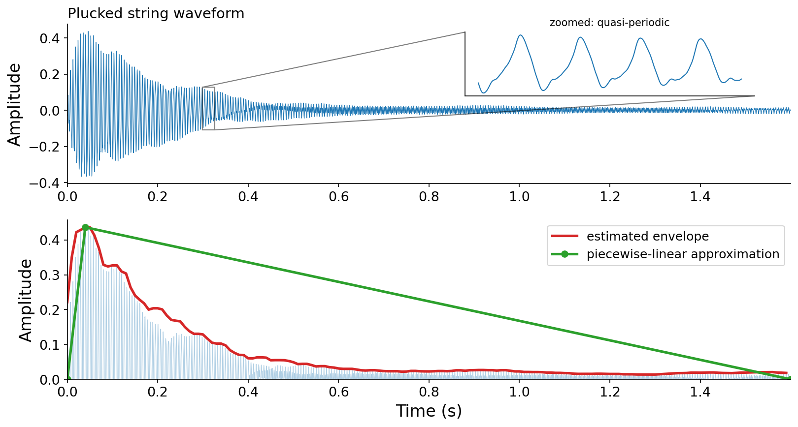
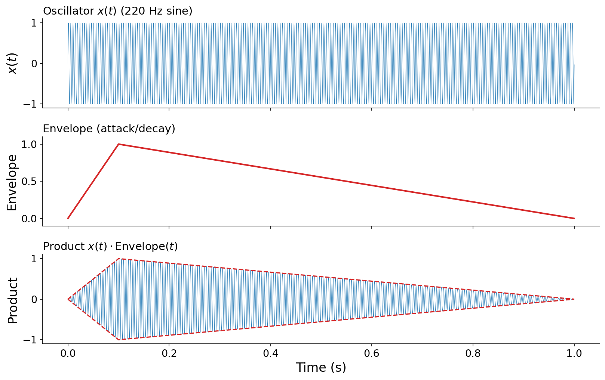
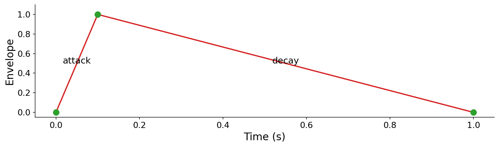

# 4.2 Envelopes

We've seen that we can combine scores with timbres to produce richer music. But there's one problem. In a musical score, events are _finite_ in duration: you pluck a string, and the sound decays away after some time. The synthesis techniques of Chapter 3, however, produce tones of theoretically _infinite_ duration: a sum of sinusoids just keeps going. {vocab}`Envelopes` bridge this gap, taking us from infinite sustained tones to finite sound events.

:::{figure}


A plucked guitar string (from Chapter 3). Top: the raw waveform, with a zoomed inset revealing its quasi-periodic oscillation. Bottom (upper half only): a smooth curve tracing the waveform's peak amplitude, its _envelope_, alongside a piecewise-linear approximation of that envelope.
:::

Consider the plucked string above. The zoomed inset reveals the quasi-periodic behavior we'd expect from the synthesis of Chapter 3. But zoomed out, the waveform has a distinct _shape_: its peak amplitude rises sharply, then decays. If we trace an outline around the waveform's peak amplitude, we get a curve that "envelopes" the oscillation within. If we could synthesize such a curve and multiply it by an oscillator, we could turn an infinite tone into a finite event. As the bottom panel suggests, even a simple piecewise-linear shape captures the essence.

## A formal view

If sound is a function $x(t) : \mathbb{R} \to \mathbb{R}$ mapping time to amplitude, an envelope is a function

$$\text{Envelope}(t) : \mathbb{R} \to [0, 1]$$

specifying an amplitude attenuation factor at each point in time, where 0 means silence and 1 means no attenuation. Crucially, an envelope is zero outside some finite window $(a, b)$:

$$
\text{Envelope}(t) \begin{cases}
\in (0, 1] & \text{if } a < t < b, \\
= 0 & \text{otherwise.}
\end{cases}
$$

We _apply_ an envelope to a sound by simple multiplication: $x(t) \cdot \text{Envelope}(t)$. Because the envelope is zero outside $(a, b)$, the product is also zero there, regardless of how $x(t)$ behaves. This accomplishes our goal of turning a potentially infinite sound into a finite one.

:::{audio-list}
{audio}`Oscillator alone <./assets/audio-env-demo-sine.wav>`

{audio}`Oscillator times envelope <./assets/audio-env-demo-enveloped.wav>`

A 220 Hz sine before and after applying an attack/decay envelope.
:::

:::{figure}


Top: the oscillator $x(t)$, a 220 Hz sine. Middle: an attack/decay envelope ($a_\text{dur} = 0.1$ s, $d_\text{dur} = 0.9$ s). Bottom: their product. The product's amplitude is bounded by the envelope (dashed), and it fades to silence at both ends.
:::

## Piecewise-linear envelopes

Envelopes are often described by piecewise-linear functions, parameterized by a set of {vocab}`control points` $(t_1, a_1), (t_2, a_2), \ldots, (t_P, a_P)$. Between consecutive control points, the envelope interpolates linearly. Outside the first and last control points, it typically is assumed to take on the edge values: $a_1$ if $t \leq a_1$, or $a_P$ if $t \geq t_P$. Accordingly, for most envelopes, $a_1 = a_P = 0$.

The simplest useful envelope has two segments and a single interior control point: an _attack_ that rises linearly from 0 to a peak, followed by a _decay_ that falls back to 0. We can write it with control points $(0, 0)$, $(a_\text{dur}, 1)$, and $(a_\text{dur} + d_\text{dur}, 0)$:

$$
\text{adenv}(t) = \begin{cases}
\dfrac{t}{a_\text{dur}} & \text{if } 0 \le t < a_\text{dur}, \\[2mm]
1 - \dfrac{t - a_\text{dur}}{d_\text{dur}} & \text{if } a_\text{dur} \le t \le a_\text{dur} + d_\text{dur}, \\[2mm]
0 & \text{otherwise.}
\end{cases}
$$

In code, we can express any piecewise-linear envelope compactly with `np.interp`, which handles the segment-by-segment interpolation for us:

```python
def adenv(a_dur: float, d_dur: float, N: int, n: int = 0) -> np.ndarray:
    t = (n + np.arange(N)) / F_S
    env = np.interp(
        t, [0.0, a_dur, a_dur + d_dur], [0.0, 1.0, 0.0]
    )
    return env[:, np.newaxis]
```

:::{margin}
Note that `adenv` returns an `np.ndarray`, not a `pq.Audio`. This is a deliberate choice: an envelope is an amplitude-shaping curve, not something we intend to _listen_ to as audio.
:::

The trailing `[:, np.newaxis]` reshapes the result to `(N, 1)` so that, recalling the `(num_samples, num_channels)` convention from [Chapter 2](../2-synthesis-vectorized), the envelope broadcasts cleanly across the channels of an `Audio` when we multiply by `adenv(...)`. Extending this to an arbitrary number of control points is left as an exercise to the reader.

:::{figure}


The output of `adenv(0.1, 0.9, ...)` over one second: a 0.1 s attack to the peak, then a 0.9 s decay. The three control points are marked.
:::

:::{audio}
[An enveloped 220 Hz tone](./assets/audio-enveloped-note.wav)

A 220 Hz sine multiplied by `adenv(0.1, 0.9, ...)`, producing a finite note. The full code is in [code/envelope.py](./code/envelope.py).
:::
