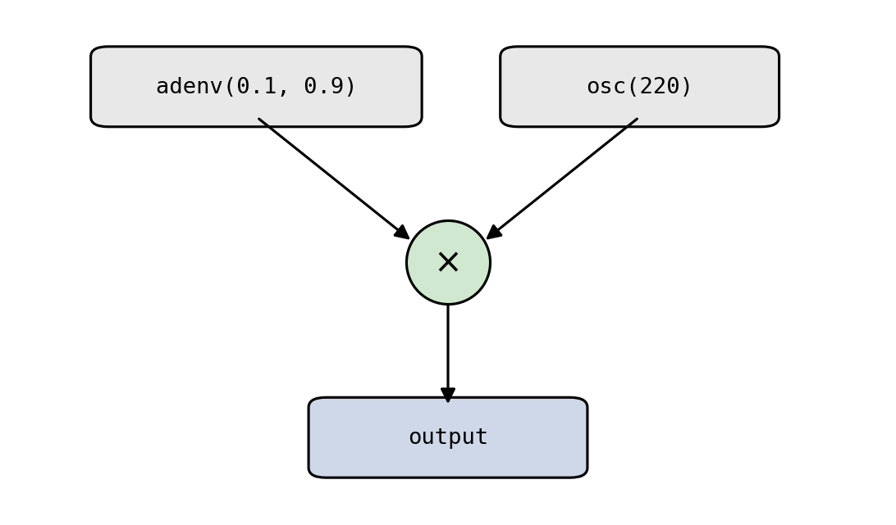
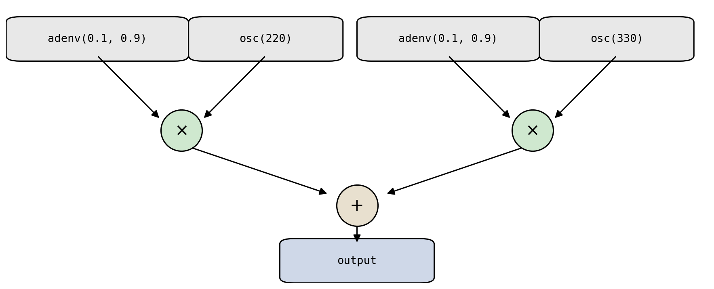
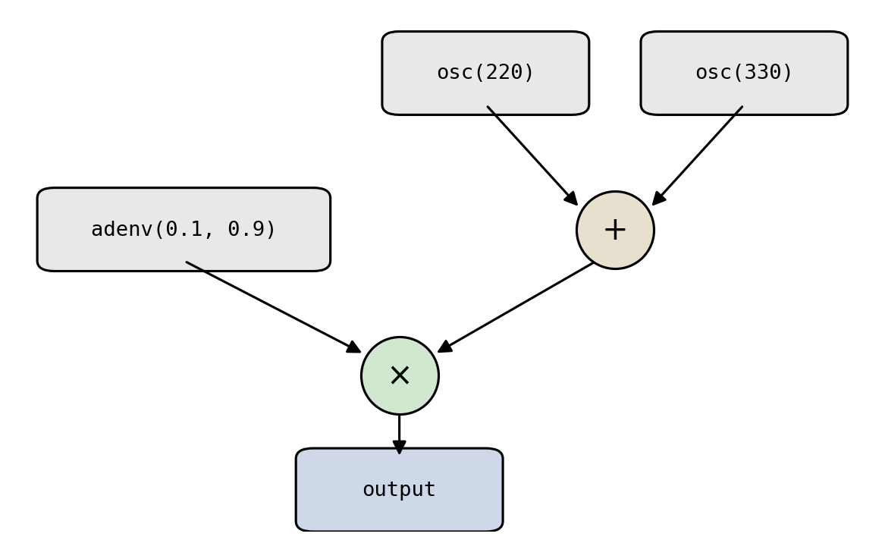

# 4.3 Unit generators and block-based computing

Creating an enveloped tone involved multiplying an oscillator by an envelope. More generally, compelling musical results come from representing synthesis and processing building blocks as reusable functions, called {vocab}`unit generators` {cite}`mathews1969technology`, and combining them into more complex topologies.

These topologies can be drawn as {vocab}`signal flow diagrams` (visualized directed graphs), or written as nested function calls. The enveloped tone above is the topology `mul(adenv(0.1, 0.9), osc(220))`:

:::{figure}


A unit-generator topology for an enveloped tone: an envelope and an oscillator feed a multiply (the circled ×), which feeds the output.
:::

Summing two enveloped tones yields a small degree of polyphony, `add(mul(adenv(0.1, 0.9), osc(220)), mul(adenv(0.1, 0.9), osc(330)))`:

:::{figure}


A larger topology: two enveloped oscillators summed into one output.
:::

:::{audio-list}
{audio}`mul(adenv, osc(220)) <./assets/audio-topology-mul.wav>`

{audio}`add of two enveloped tones <./assets/audio-topology-add.wav>`

The two topologies above, rendered to audio.
:::

The same musical result can often be expressed by different topologies, and some are more _efficient_ than others. Since multiplication distributes over addition, $\text{adenv} \cdot \text{osc}_1 + \text{adenv} \cdot \text{osc}_2 = \text{adenv} \cdot (\text{osc}_1 + \text{osc}_2)$. The right-hand side, `mul(adenv(0.1, 0.9), add(osc(220), osc(330)))`, computes the _identical_ signal with one fewer envelope and one fewer multiply:

:::{figure}


An equivalent but cheaper topology: factoring out the shared envelope replaces two multiplies and two envelopes with one of each.
:::

Full-fledged computer music programming languages (Nyquist, Csound, Pure Data, Max/MSP, etc.) ship with comprehensive libraries of unit-generator primitives. Some will even attempt to compile your topology into a more efficient implementation. Pyquist takes a more hands-off approach: **you implement your own unit generators**, as functions that take parameters or audio as input and produce sound.

Across many frameworks, unit generators are at the core of computer music programming. So how do we implement them _efficiently_?

## Efficient unit generators via block-based computing

We run unit generators by calling and combining functions. But synthesis must produce many thousands, even millions, of samples, so we need an execution strategy that is efficient in both memory and compute. The key points of tension are that **audio samples can take up a lot of memory** (a single channel of `float32` audio at 44.1 kHz is about $1.4$ ${unit}`megabits,second`$), and **function calls have overhead**.

There are three natural strategies for computing the outputs of several unit generators across many samples. To compare them, suppose our topology has $M$ unit generators and we want to synthesize $N$ total samples. Our running example will be `mul(adenv(0.1, 0.9), osc(220))`, with $M = 3$ unit generators: the envelope, the oscillator, and the multiply.

**Ugen-by-ugen.** Run each unit generator once to synthesize _all_ of its samples, then combine.

```python
ugen_a = adenv(0.1, 0.9, N)         # a full N-sample env array
ugen_b = osc(220.0, N)              # a full N-sample osc array
ugen_by_ugen = mul(ugen_a, ugen_b)  # ...and a third for the product
```

This makes only $O(M)$ function calls (good!). But every unit generator allocates a full $N$-sample array, and all of them are alive at once, so it costs $O(M \cdot N)$ memory (bad!). Notice the three live arrays above for just this tiny network.

**Sample-by-sample.** For each output sample, run every unit generator for that one sample, then combine.

```python
sample_by_sample = []
for n in range(N):
    sample_by_sample.append(mul(adenv(0.1, 0.9, 1, n), osc(220.0, 1, n)))
sample_by_sample = pq.Audio.concatenate(sample_by_sample)
```

This is the mirror image scenario: only $O(M)$ samples are ever held at once (good!), but it makes $O(M \cdot N)$ function calls (bad!).

**Block-by-block.** Process the signal in fixed-size blocks of $B$ samples, running each unit generator once per block.

```python
B = 441  # block size in samples (0.01 s)
block_by_block = []
for n in range(0, N, B):
    block_by_block.append(mul(adenv(0.1, 0.9, B, n), osc(220.0, B, n)))
block_by_block = pq.Audio.concatenate(block_by_block)
```

This is the sweet spot: $O(M \cdot B)$ memory and $O(M \cdot N / B)$ function calls. By choosing $B$, we trade off between the two extremes. The full runnable comparison is in [code/block_based.py](./code/block_based.py), which verifies all three produce identical output.

These call counts only matter because each call carries overhead. The actual cost depends on hardware, language, and the unit generator itself, so rather than measure it, let's just **suppose for illustration that one function call costs about as much as computing 100 samples**. Plugging in $N = 44{,}100$ (one second), $M = 3$, and $B = 441$ makes the tradeoff concrete:

:::{list-table} Cost of each strategy for one second of our three-ugen network
:header-rows: 1
:name: tbl-block-costs

- - Strategy
  - Function calls
  - Overhead (sample-equiv.)
  - Peak memory (samples)
- - Ugen-by-ugen
  - 3
  - ~300
  - ~132,300
- - Sample-by-sample
  - 132,300
  - ~13,230,000
  - ~3
- - Block-by-block ($B = 441$)
    - 300
    - ~30,000
    - ~1,323
      :::

Sample-by-sample wastes enormous effort on call overhead; ugen-by-ugen consumes a very large amount of memory; block-by-block keeps both modest.

**Most computer music software computes audio in blocks** {cite}`puckette2007theory`. You will see blocks throughout the computer music stack, and block-based computing will be essential again when we discuss real-time, interactive audio later in the book. It's a good habit to practice. That said, you don't _always_ need it: with modern hardware, ugen-by-ugen is often perfectly practical when working in pyquist, and even sample-by-sample has its place.

## Idioms for implementing unit generators

A unit generator must produce successive blocks while remembering where it left off (here, the oscillator's phase). Python offers several idioms for managing that state, each with different tradeoffs:

1. As a pure **function of the global sample index**, with the caller tracking position.
1. As a **function that passes state in and out** explicitly.
1. As an **iterator** that yields successive blocks, hiding the state in its local scope.
1. As a **stateful object** that remembers its own phase between calls.

```python
# (1) Function of the global sample index n
def osc(f_0: float, N: int, n: int = 0) -> pq.Audio:
    t = (n + np.arange(N)) / F_S
    return pq.Audio(np.sin(2.0 * np.pi * f_0 * t), F_S)

# (2) Passes phase state in and out
def osc_stateless(f_0: float, N: int, phase: float = 0.0) -> tuple[pq.Audio, float]:
    d_phase = 2.0 * np.pi * f_0 / F_S
    phases = phase + np.arange(N) * d_phase
    return pq.Audio(np.sin(phases), F_S), phase + N * d_phase

# (3) Iterator over blocks
def osc_iter(f_0: float, B: int) -> Iterator[pq.Audio]:
    phase = 0.0
    while True:
        block, phase = osc_stateless(f_0, B, phase)
        yield block

# (4) Stateful object
class Osc:
    def __init__(self, f_0: float) -> None:
        self.d_phase = 2.0 * np.pi * f_0 / F_S
        self.phase = 0.0

    def __call__(self, N: int) -> pq.Audio:
        phases = self.phase + np.arange(N) * self.d_phase
        self.phase += N * self.d_phase
        return pq.Audio(np.sin(phases), F_S)
```

These idioms produce identical output but suit different situations; [code/unit_generators.py](./code/unit_generators.py) runs all four and confirms they agree. We do not make a particular recommendation of one over the others. Experiment and find what works best for your application and your programming taste.
