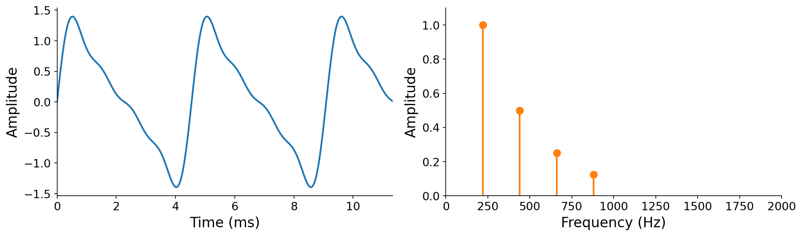

# 5.0 Time and frequency

Until now, we have looked at sound in the {vocab}`time domain`: a waveform $x(t) : \mathbb{R} \to \mathbb{R}$ that maps each instant in time to an amplitude (see {ref}`sec-waveforms`). The time domain is intuitive because it mirrors how sound physically propagates: the form it is in when it reaches our ears or microphones. But it is not the only way to reason about sound.

:::{margin}
Why $|X(f)|$, with the absolute-value bars, rather than just $X(f)$? It turns out that the frequency-domain representation is intrinsically complex-valued, and taking the absolute value extracts amplitudes. We will build up to this over the course of the chapter.
:::

We now introduce a complementary view: the frequency domain. Here we describe a sound by a function $|X(f)| : \mathbb{R} \to \mathbb{R}$ that reports the _amplitude_ associated with each frequency $f$, in other words, **how much of frequency $f$ is present** in the sound.

To make this concrete, recall the time-domain definition of additive synthesis from {prf:ref}`def-additive-synthesis`:

$$x(t) = \sum_{k=1}^{K} a_k \sin(2\pi [k \cdot f_0] \, t + \phi_k).$$

By summing harmonics, we produce a familiar dense, continuous picture in the time domain. But what would the same sound look like in the frequency domain? Pause and think about it before reading on.

The key insight is that **the coefficients of additive synthesis already answer the question of "how much of each frequency"**. The $k$-th harmonic, at frequency $k \cdot f_0$, contributes amplitude $a_k$. Every other frequency contributes nothing. Plotting amplitude against frequency for the four-harmonic recipe $\mathbf{a} = [1, \tfrac{1}{2}, \tfrac{1}{4}, \tfrac{1}{8}]$ at $f_0 = 220$ Hz:

:::{figure}

The same sound in two domains. Left: the time-domain waveform $x(t)$, dense and continuous. Right: the frequency-domain amplitude $|X(f)|$, sparse and discontinuous, with a spike at each harmonic.
:::

More formally, the amplitude spectrum of an additively synthesized tone is zero at every frequency except the harmonics, where it takes the value of the corresponding amplitude coefficient:

$$
|X(f)| = \begin{cases}
a_k & \text{if } f = k \cdot f_0 \text{ for some } k \in \{1, 2, \ldots, K\}, \\
0 & \text{otherwise.}
\end{cases}
$$

This reveals a key contrast between the two domains. While the time-domain waveform is dense and continuous, the frequency-domain representation is **sparse and discontinuous**: almost every frequency has amplitude zero, with energy concentrated into infinitesimally narrow "spikes" at integer multiples of $f_0$. Those spikes still encode almost the entire recipe: the fundamental $f_0$ (their spacing), the number of harmonics $K$ (their count), and the amplitudes $\mathbf{a}$ (their heights). The one ingredient they discard is the _initial phases_ $\boldsymbol{\phi}$. That loss is acceptable for now because, as we saw in Chapter 3, our ear is largely insensitive to phase. We will return to where the phase information goes later in this chapter.

:::{audio}
[The four-harmonic recipe](./assets/audio-recipe.wav)

The tone whose two representations are shown above, included as a reminder of what this recipe sounds like.
:::

To reinforce this new perspective, consider the basic waveform shapes from Chapter 3, now viewed through the same lens. Each is just a particular pattern of harmonic amplitudes, so each has a distinctive frequency-domain fingerprint:

:::{audio-board}
{audio}`Sawtooth <./assets/audio-saw.wav>`

{audio}`Square <./assets/audio-square.wav>`

{audio}`Triangle <./assets/audio-triangle.wav>`

The sawtooth, square, and triangle waves in both domains. Top: the familiar time-domain shapes. Bottom: their amplitude spectra (normalized so the fundamental is 1). The sawtooth contains all harmonics ($a_k \propto 1/k$), while the square and triangle contain only odd harmonics ($1/k$ and $1/k^2$ respectively). Each shape's character comes entirely from its pattern of harmonic amplitudes.
:::

There is a catch. We could draw these frequency-domain plots only because we already had access to the sound-producing algorithm (additive synthesis) and its recipe (the coefficients). What if you were handed a sound for which you knew _nothing_ about how it was made?

This is a bit like cooking. If you already know the recipe, reproducing a dish is easy. But if you order a dish at a restaurant, you do not get the recipe. You would have to reverse-engineer it from the dish itself. How can we uncover the "recipe" of frequencies from a sound alone?

Remarkably, it turns out that uncovering the recipe is easier for sound than it is for food! **Every sound has a unique recipe of frequency information that can be recovered in closed form from the sound itself**. The tool that recovers it is the Fourier transform. To build it, we first need to brush up on the complex plane.
