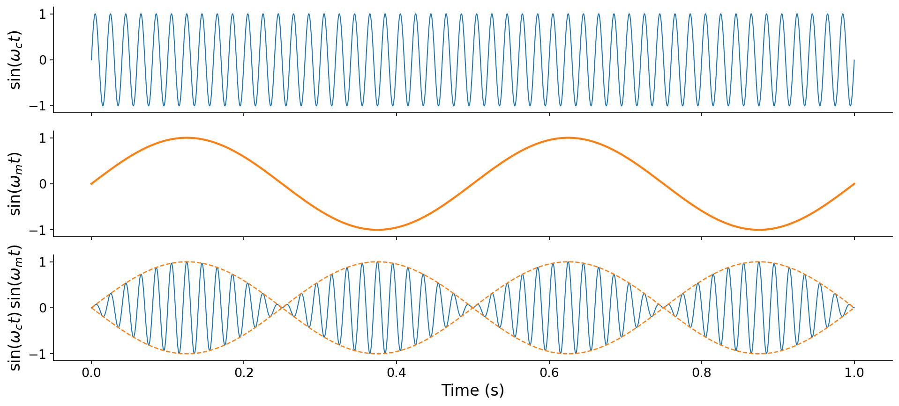

# 6.0 Ring modulation

Let us start with {vocab}`tremolo`, a musical performance technique that periodically varies the _amplitude_ of a note over time.

:::{audio}
[Cello with tremolo](./assets/audio-cello-tremolo.wav)

The cello tremolo again. Focus on the periodic swelling and fading of loudness.
:::

How might we synthesize this effect? In [Chapter 4](../04-score-timbre) we studied amplitude envelopes, where we multiplied a sustained tone by a piecewise-linear function to shape its loudness. Tremolo is similar, except that the amplitude change is _periodic_ over time rather than a one-shot attack and decay. This suggests an idea: to emulate tremolo, we can "envelope" a periodic sound with a second sinusoid that oscillates slowly. Multiplying two sinusoids in this way is called {vocab}`ring modulation`.

:::{prf:definition} Ring modulation
:label: def-ring-modulation
Given a {vocab}`carrier frequency` $\omega_c$ and a {vocab}`modulating frequency` $\omega_m$, _ring modulation_ is the product of two sinusoids at those frequencies:

$$\text{RingMod}(t) = \sin(\omega_c t) \cdot \sin(\omega_m t).$$
:::

:::{margin}
Ring modulation takes its name from its original analog implementation, in which the circuit that multiplied the two signals was built from a _ring_ of four diodes.
:::

When the modulating frequency is low (below roughly 10 Hz), we perceive the result exactly as tremolo: a tone at the carrier frequency whose loudness pulses at the modulating rate. The following figure shows why. The fast carrier is shaped by the slow modulator, so the modulator traces out an amplitude envelope around the carrier:

:::{figure}

Ring modulation in the time domain. The fast carrier $\sin(\omega_c t)$ (top) is multiplied by the slow modulator $\sin(\omega_m t)$ (middle). In the product (bottom), the modulator acts as an envelope (dashed), pinching the amplitude to zero and swelling it back four times per second (twice per modulator cycle).
:::

Listen to ring modulation at a few carrier and modulating frequencies. Each is a pure carrier tone with a slow tremolo:

:::{audio-list}
{audio}`Carrier 220 Hz, modulator 1 Hz <./assets/audio-rm-220x1.wav>`

{audio}`Carrier 220 Hz, modulator 2 Hz <./assets/audio-rm-220x2.wav>`

{audio}`Carrier 330 Hz, modulator 1 Hz <./assets/audio-rm-330x1.wav>`

{audio}`Carrier 330 Hz, modulator 2 Hz <./assets/audio-rm-330x2.wav>`

Ring modulation with slow modulators. The carrier sets the pitch, and the modulator sets the tremolo rate.
:::

You may notice that the loudness pulses at _twice_ the modulating frequency. A 1 Hz modulator gives two pulses per second, not one. This is because the envelope is the _absolute value_ $|\sin(\omega_m t)|$. The amplitude swells to a peak whenever $\sin(\omega_m t)$ reaches either its positive _or_ its negative extreme, and it dips to silence at each of the modulator's zero crossings. Since a sinusoid has two extremes per cycle, we hear two swells per modulator cycle.

By replacing the pure carrier sinusoid with a more complex sound, ring modulation becomes a general-purpose audio _effect_ that adds tremolo to any input. The modulator simply multiplies whatever signal we feed in. Here it is applied to a xylophone recording with a 1 Hz modulator:

:::{audio-list}
{audio}`Original xylophone <./assets/audio-effect-source.wav>`

{audio}`With 1 Hz ring modulation <./assets/audio-effect-ringmod.wav>`

Ring modulation applied to a recorded sound rather than a pure tone. The 1 Hz modulator adds a slow tremolo. [19460](https://freesound.org/s/19460/) by Tristan, License: [CC0 1.0](http://creativecommons.org/publicdomain/zero/1.0/).
:::

Ring modulation is an intuitive way to add tremolo, and its time-domain mechanics are clear. But something more subtle is happening in the frequency domain. To see it, let us listen to what happens next as we steadily _increase_ the modulating frequency.
