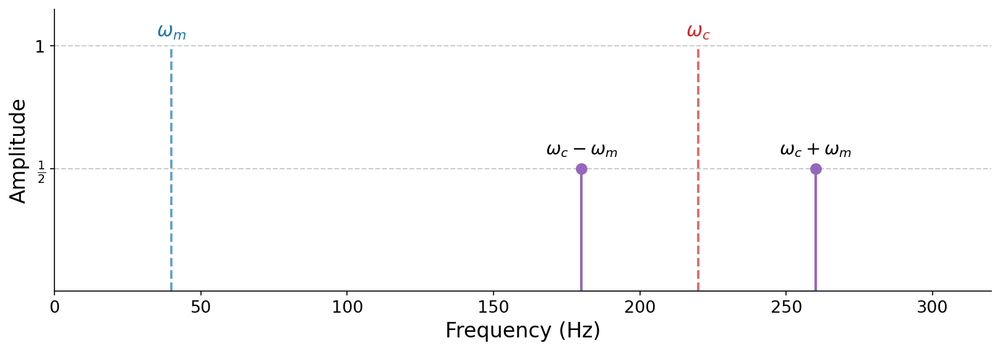

# 6.1 Sidebands

Here is a fixed carrier at 240 Hz ring-modulated by a modulator whose frequency climbs from 3 Hz to 48 Hz:

:::{audio-list}
{audio}`Modulator 3 Hz <./assets/audio-rm-240x3.wav>`

{audio}`Modulator 6 Hz <./assets/audio-rm-240x6.wav>`

{audio}`Modulator 12 Hz <./assets/audio-rm-240x12.wav>`

{audio}`Modulator 24 Hz <./assets/audio-rm-240x24.wav>`

{audio}`Modulator 48 Hz <./assets/audio-rm-240x48.wav>`

A fixed 240 Hz carrier, ring-modulated at increasing rates.
:::

An interesting perceptual shift emerges. At 3 Hz we clearly hear a _single_ tone with fast tremolo. But by 48 Hz, we no longer hear tremolo at all. Instead we hear _two distinct tones_. Why does modulating a single frequency produce what sounds like multiple frequencies?

The answer is that ring modulation has a striking effect in the frequency domain. From two "input" sinusoids at frequencies $\omega_c$ and $\omega_m$, it produces two _completely different_ "output" sinusoids, at the sum and difference frequencies $\omega_c + \omega_m$ and $\omega_c - \omega_m$. The original input frequencies vanish from the spectrum entirely. These new frequencies are called {vocab}`sidebands`, a general term for the frequency content that modulation creates on either side of a carrier. We will see sidebands emerge from _every_ modulation technique in this chapter.

This behavior follows directly from a trigonometric identity. Recall the angle-sum and angle-difference identities for cosine:

$$
\begin{aligned}
\cos(A + B) &= \cos A \cos B - \sin A \sin B, \\
\cos(A - B) &= \cos A \cos B + \sin A \sin B.
\end{aligned}
$$

Subtracting the first from the second cancels the cosine terms and leaves $\cos(A - B) - \cos(A + B) = 2 \sin A \sin B$. Rearranging gives a _product-to-sum_ identity that turns a product of sines into a sum:

$$\sin A \sin B = \tfrac{1}{2}\big[\cos(A - B) - \cos(A + B)\big].$$

Substituting $A = \omega_c t$ and $B = \omega_m t$, we can rewrite ring modulation as a _sum_ of two sinusoids:

$$\sin(\omega_c t)\,\sin(\omega_m t) = \tfrac{1}{2}\cos\big((\omega_c - \omega_m)\,t\big) - \tfrac{1}{2}\cos\big((\omega_c + \omega_m)\,t\big).$$

There they are: two sinusoids, at $\omega_c - \omega_m$ and $\omega_c + \omega_m$, each with amplitude $\tfrac{1}{2}$. The carrier and modulator frequencies themselves are nowhere to be found.

:::{figure}

The frequency-domain view of ring modulation. The input frequencies $\omega_m$ and $\omega_c$ (dashed) disappear, replaced by two sidebands at $\omega_c - \omega_m$ and $\omega_c + \omega_m$ (solid), each with amplitude $\tfrac{1}{2}$.
:::

:::{note}
The minus sign on the upper sideband, $-\tfrac{1}{2}\cos((\omega_c + \omega_m)t)$, does not change its _amplitude_. Since $-\cos(\theta) = \cos(\theta + \pi)$, the sign is just a phase shift of $\pi$ radians, which we cannot hear. Both sidebands have amplitude $\tfrac{1}{2}$ in the amplitude spectrum. We will return to this connection between signs and phase in a moment.
:::

This explains the perceptual shift we heard. When $\omega_m$ is small, the two sidebands $\omega_c \pm \omega_m$ sit very close together (for the 3 Hz example, at 237 and 243 Hz), and our ear fuses them into a single tone that seems to beat, or pulse. As $\omega_m$ grows, the sidebands spread apart (for the 48 Hz example, to 192 and 288 Hz), far enough that our ear resolves them as two separate tones. The underlying mathematics are the same in both cases, but our perception differs! Past a certain threshold of modulation frequency, our perception shifts from tremolo to _polyphony_.

(sec-negative-frequencies)=
