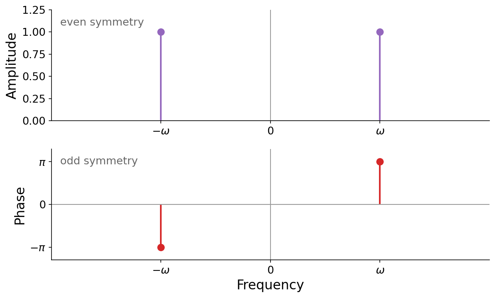
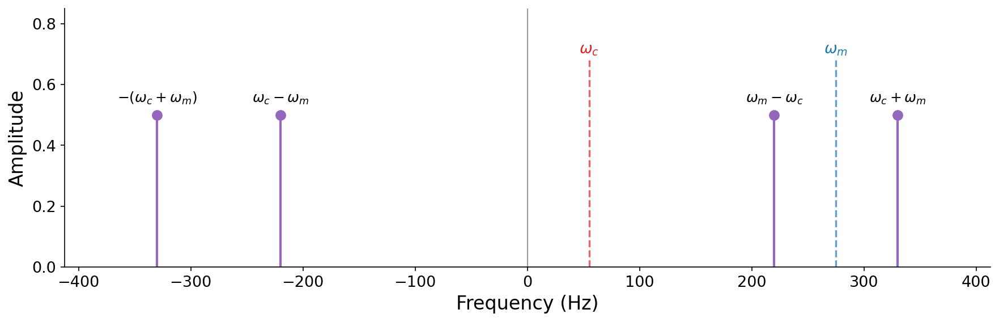

# 6.2 Negative frequencies

The sideband picture raises a subtle puzzle. Ring modulation is a product of two sinusoids, and multiplication is commutative, so $\sin(\omega_c t)\,\sin(\omega_m t)$ and $\sin(\omega_m t)\,\sin(\omega_c t)$ must be the exact same signal. Yet if we apply our product-to-sum identity to each, the first gives sidebands at $\omega_c \pm \omega_m$, while the second gives sidebands at $\omega_m \pm \omega_c$. The sum frequencies agree ($\omega_c + \omega_m = \omega_m + \omega_c$), but the difference frequencies do not: in general, $\omega_c - \omega_m \neq \omega_m - \omega_c$. How can the same signal have two different spectra?

To make sense of this, we need to take seriously a possibility we have so far avoided: that a frequency can be _negative_. Our examples until now quietly assumed $\omega_m < \omega_c$, so that the lower sideband $\omega_c - \omega_m$ came out positive. But nothing stops us from choosing $\omega_m > \omega_c$, and then **the lower sideband $\omega_c - \omega_m$ is a _negative_ frequency**.

This is the first time we have _explicitly_ met a negative frequency, but the idea is less exotic than it sounds. Back in [Chapter 3](../03-additive-synthesis), we saw that shifting a sinusoid's _phase_ slides it in time without changing its pitch, and that our ears are largely deaf to such shifts. As we are about to see, a negative frequency is nothing more than a phase-shifted positive frequency, a fact that follows directly from the same kind of trigonometric reasoning we used above.

What does a negative frequency _sound_ like? Exactly like its positive counterpart. This follows from the symmetry of the sinusoids. Cosine is an _even_ function and sine is an _odd_ function:

$$\cos(-\omega t) = \cos(\omega t), \qquad \sin(-\omega t) = -\sin(\omega t) = \sin(\omega t + \pi).$$

A negative-frequency cosine is _identical_ to its positive twin. A negative-frequency sine equals its positive twin flipped in sign, which is just a phase shift of $\pi$. Either way, the difference is at most a phase shift, and our ears are insensitive to absolute phase. We can confirm this by ear with a cosine at 220 Hz and one at -220 Hz:

:::{audio-list}
{audio}`Cosine at 220 Hz <./assets/audio-cos-pos220.wav>`

{audio}`Cosine at -220 Hz <./assets/audio-cos-neg220.wav>`

A positive and a negative frequency. For a cosine, $\cos(-\omega t) = \cos(\omega t)$ holds exactly, so these two clips are not merely audibly but _mathematically_ identical. Negative frequencies are an audible, physical reality of sound, not just an analytical device like the imaginary unit $j$.
:::

We can package this symmetry in terms of the amplitude and phase spectra from [Chapter 5](../05-frequency-domain). Because a negative frequency carries the same amplitude as its positive twin but the opposite phase, the amplitude spectrum of any real signal is **even** (symmetric about zero), and the phase spectrum is **odd** (antisymmetric):

$$|X(-\omega)| = |X(\omega)|, \qquad \angle X(-\omega) = -\angle X(\omega).$$

:::{figure}

The spectra of a real sinusoid are symmetric about zero frequency. The amplitude spectrum (top) is even, and the phase spectrum (bottom) is odd. This is why every positive frequency is mirrored by a negative one.
:::

The high-level insight here: **any negative frequency can be interpreted as a phase-shifted positive frequency.** Phase shifts and negative frequencies are two sides of the same coin. This is not just an analytical concept like the imaginary unit $j$. It is a real, audible and mathematical phenomenon, and it will have important consequences when we study sampling theory in the [next chapter](../07-sampling-theory).

Now we can resolve the puzzle. When $\omega_m > \omega_c$, the difference sideband $\omega_c - \omega_m$ is negative, but by even symmetry it shows up in the amplitude spectrum at $|\omega_c - \omega_m| = \omega_m - \omega_c$, which is exactly the sideband the commuted expression predicted. The two derivations agree after all. Accounting for the negative frequencies that are always present, ring modulation really produces _four_ sidebands, symmetric about zero:

$$\{\,-(\omega_c + \omega_m),\; \omega_c - \omega_m,\; \omega_m - \omega_c,\; \omega_c + \omega_m\,\}.$$

:::{figure}

The full spectrum of ring modulation, including negative frequencies, for a case where $\omega_m > \omega_c$. The four sidebands are symmetric about zero. The two positive-frequency sidebands are what we hear.
:::

Because the amplitude spectrum is symmetric, we can freely swap $\omega_c$ and $\omega_m$ with no audible change, which finally makes the commutativity of multiplication consistent with the frequency-domain picture.
