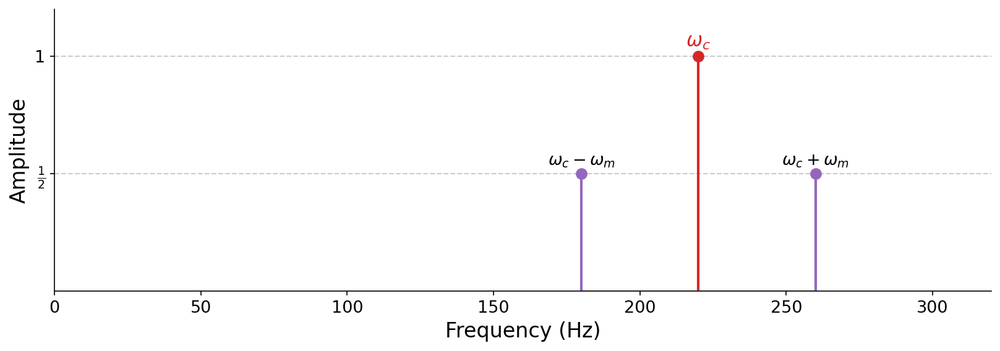

# 6.3 Amplitude modulation

Our original goal with ring modulation was simply to add a tremolo envelope. But in doing so, we accidentally _removed the carrier itself_ from the spectrum, replacing it with two sidebands. What if we want the tremolo effect while _keeping_ the original carrier tone?

The fix is intuitive: just add the carrier back in. Starting from ring modulation and adding an unmodulated copy of the carrier gives $\sin(\omega_c t) + \sin(\omega_c t)\,\sin(\omega_m t)$, which we can factor into a cleaner form that also conveniently reduces the number of sinusoids needed for computation. This is {vocab}`amplitude modulation`.

:::{prf:definition} Amplitude modulation
:label: def-amplitude-modulation
_Amplitude modulation_ (AM) multiplies a carrier by a modulator that oscillates around a nonzero average:

$$\text{AmpMod}(t) = \sin(\omega_c t)\,\big[1 + \sin(\omega_m t)\big].$$
:::

Expanding the product shows what AM does in the frequency domain. It is just ring modulation plus the original carrier:

$$\sin(\omega_c t)\big[1 + \sin(\omega_m t)\big] = \underbrace{\sin(\omega_c t)}_{\text{carrier}} + \underbrace{\sin(\omega_c t)\sin(\omega_m t)}_{\text{sidebands}}.$$

So the spectrum retains the carrier at $\omega_c$ with amplitude 1, and adds the two ring-modulation sidebands at $\omega_c \pm \omega_m$, each with amplitude $\tfrac{1}{2}$:

:::{figure}

The spectrum of amplitude modulation. Unlike ring modulation, the carrier at $\omega_c$ survives (amplitude 1), flanked by the two sidebands at $\omega_c \pm \omega_m$ (amplitude $\tfrac{1}{2}$).
:::

:::{audio}
[Amplitude modulation, carrier 220 Hz, modulator 55 Hz](./assets/audio-am-220x55.wav)

Amplitude modulation. Because the modulator is in the audible range, we hear the carrier at 220 Hz together with its two sidebands, rather than a tremolo.
:::

We can control the balance between the carrier and its sidebands with a ratio parameter $r$:

$$\text{AmpMod}(t) = \sin(\omega_c t)\,\Big[\tfrac{r}{2} + \sin(\omega_m t)\Big],$$

where $r$ is the ratio of the carrier's amplitude to each sideband's amplitude. Setting $r = 2$ recovers the definition above where the amplitude of $\omega_c$ is twice that of the sidebands. By carefully choosing $\omega_c$, $\omega_m$, and $r$, amplitude modulation can even be used to design specific harmonic spectra, an idea we will develop in the exercises.
