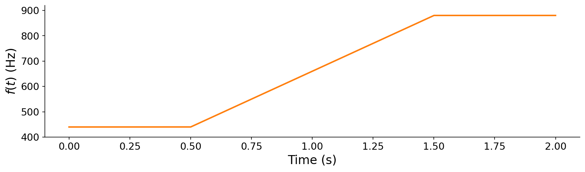

# 6.4 Modulating frequency over time

The modulation techniques so far all center on modulating _amplitude_ over time. They have interesting side effects in the frequency domain, but what if we want to modulate _frequency_ in a more direct way? For example, how would we synthesize {vocab}`vibrato`, where a performer wavers the fundamental frequency of their sound over time?

:::{audio}
[Guitar with vibrato](./assets/audio-guitar-vibrato.wav)

The guitar vibrato from the introduction. The pitch itself wavers periodically.
:::

Let us revisit the basic sinusoid from [Chapter 3](../03-additive-synthesis), taking unit amplitude and zero initial phase for simplicity:

$$x(t) = \sin(\omega t),$$

with angular frequency $\omega = 2\pi f$ in ${unit}`radians,second`$.

:::{tip}
As always, if you feel rusty with angular frequency, revisit [Chapter 3](../03-additive-synthesis). We work in angular frequency $\omega$ here to keep the expressions compact.
:::

To get vibrato, we want the frequency $\omega$ to change over time, so we replace the constant $\omega$ with a function $\omega(t)$. The tempting first attempt is to substitute it directly into the formula:

$$x(t) = \sin\big(\omega(t)\cdot t\big) \quad \longrightarrow \quad x[n] = \sin\big(\omega[n]\cdot n \,\Delta t\big),$$

where $\Delta t = 1/f_s$ is the sample period. **This is wrong.** To hear why, let us drive it with a frequency that ramps from 440 Hz up to 880 Hz:

:::{figure}


A time-varying frequency control signal $f(t)$: 440 Hz held, ramped up to 880 Hz, then held. We will use it to drive both the wrong and the correct time-varying oscillators.
:::

:::{audio-list}
{audio}`The wrong way <./assets/audio-timevar-wrong.wav>`

{audio}`The correct way <./assets/audio-timevar-right.wav>`

The same frequency ramp, synthesized two ways. The wrong way has two discontinuous jumps in frequency at the start and end of the ramp up, while the right way ramps smoothly from 440 Hz to 880 Hz.
:::

Why does the naive version fail so badly? The problem is that $\sin(\omega(t)\cdot t)$ confuses _frequency_ with _phase_. The argument to $\sin$ should be the accumulated _instantaneous phase_, the total number of radians the oscillator has swept out so far. When $\omega$ is constant, that accumulation is exactly $\omega t$. But when $\omega$ changes over time, multiplying the _current_ frequency by the _total_ elapsed time erases history. It retroactively pretends the oscillator was always running at its current frequency.

The fix is to recognize that frequency is a _rate of change_ of phase, so to recover phase we must _accumulate_ (integrate) frequency over time. In continuous terms, we rewrite the basic sinusoid with an integral:

$$x(t) = \sin\!\left(\int_0^t \omega(\tau)\, d\tau\right).$$

:::{note}
Do not be alarmed by the integral sign. As we noted in [Chapter 5](../05-frequency-domain), working out closed-form integrals is not a focus of this book. Read the integral at a high level: it simply **sums up how much phase has elapsed** up to time $t$. When $\omega(\tau) = \omega$ is constant, the area under a flat line from $0$ to $t$ is just $\omega t$, recovering the familiar $\sin(\omega t)$. That equivalence is exactly why we "got away with" the simple form for constant-frequency tones.
:::

On a computer, we cannot evaluate the continuous integral directly. Instead, we approximate it with a _Riemann sum_: we chop time into slices one sample wide, compute the sliver of phase $\omega[n]\,\Delta t$ contributed by each, and add them up. This converts the integral into a discrete sum, exactly as we converted the continuous formula into a sampled one above:

$$x(t) = \sin\!\left(\int_0^t \omega(\tau)\, d\tau\right) \quad \longrightarrow \quad x[n] = \sin\!\left(\sum_{k=0}^{n} \omega[k]\,\Delta t\right).$$

This is now correct, but naively it is also slow. Recomputing the whole sum from scratch for every sample $n$ would cost $O(N^2)$ operations. We can do much better by noticing that each phase sum is just the _previous_ one plus a single new term. Naming the accumulated phase $\theta[n] = \sum_{k=0}^{n}\omega[k]\,\Delta t$, we get a simple recurrence:

$$\theta[n] = \theta[n-1] + \omega[n]\,\Delta t, \qquad x[n] = \sin(\theta[n]).$$

This _accumulate-a-running-total_ trick brings the cost back down to $O(N)$. In code, it is a short loop that carries the phase forward one sample at a time:

```python
def osc(freq: np.ndarray, f_s: int = 44100) -> pq.Audio:
    theta = 0.0
    x = np.zeros(len(freq), dtype=np.float32)
    for n in range(len(freq)):
        theta += 2 * np.pi * freq[n] / f_s   # accumulate phase
        x[n] = np.sin(theta)
    return pq.Audio(x, f_s)
```

The full runnable comparison of the wrong and correct oscillators, including a vectorized `np.cumsum` version, is in [code/modulation.py](./code/modulation.py). With a correct time-varying oscillator in hand, vibrato is just a matter of choosing $\omega(\tau)$ to waver gently around a center frequency. That choice is the gateway to frequency modulation.
