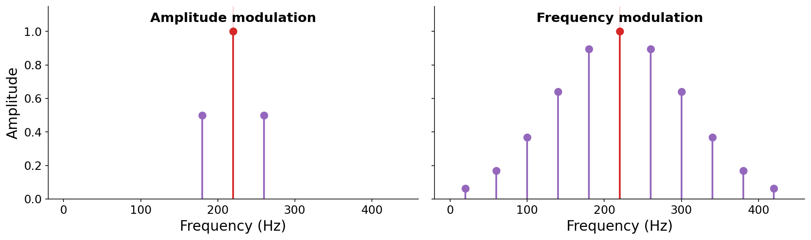

# 6.6 FM sidebands

Vibrato is FM with a slow, shallow modulator. But the real power of FM appears when the modulator runs at audio rates. Recall the trumpet from the introduction, whose harmonics shift in balance continuously over time. Reproducing that with additive synthesis would demand many oscillators, each with its own time-varying amplitude. FM offers a wildly more efficient route.

Just as with ring and amplitude modulation, FM produces sidebands. But where those techniques produced only two, FM produces a _theoretically infinite_ series of sidebands, spaced evenly around the carrier at

$$f_c \pm k \cdot f_m, \qquad k \in \mathbb{Z}^+.$$

This is the key to FM's efficiency. **Two oscillators can generate an arbitrarily rich spectrum.** The following figure shows the finite (three-line) spectrum of amplitude modulation with the infinite (many-line) spectrum of frequency modulation:

:::{figure}

Amplitude modulation (left) creates just two sidebands, while frequency modulation (right) creates an entire series of sidebands at $f_c \pm k f_m$. The FM spectrum shown is schematic. The next figure measures the real thing.
:::

Two parameters shape the FM spectrum. First, **the ratio $f_c / f_m$ determines the harmonicity** of the result. When $f_c / f_m$ is a simple rational number, the sidebands land on integer multiples of a common fundamental, producing a _harmonic_, pitched tone. When the ratio is irrational, the sidebands are inharmonic, producing bell-like or metallic timbres.

:::{audio-list}
{audio}`Harmonic, $f_c/f_m = 2$ <./assets/audio-fm-harmonic.wav>`

{audio}`Inharmonic, $f_c/f_m = 5/7$ <./assets/audio-fm-bell.wav>`

Two FM tones at the same index of modulation ($I = 3$). Left: a simple ratio ($f_c = 440$ Hz, $f_m = 220$ Hz) lands the sidebands on integer multiples of a common fundamental, giving a harmonic, pitched tone. Right: an irrational-sounding ratio ($f_c = 200$ Hz, $f_m = 280$ Hz) gives an inharmonic, bell-like timbre.
:::

Second, **the number of _audible_ sidebands is controlled by the {vocab}`index of modulation`**

$$I = \frac{D}{f_m}.$$

As $I$ grows, energy spreads from the carrier out into more and more sidebands, and the tone brightens. A useful rule of thumb is that roughly $I + 1$ sidebands are audible on each side of the carrier. The following figure measures the actual FM spectrum (via the Fourier transform) as the index of modulation increases:

:::{figure}

The measured spectrum of an FM tone ($f_c = 440$ Hz, $f_m = 110$ Hz) as the index of modulation $I$ increases. At $I = 0$ there is only the carrier. As $I$ grows, sidebands appear at $f_c + k f_m$ and energy spreads outward, roughly $I + 1$ sidebands to a side.
:::

:::{audio-list}
{audio}`Index of modulation 1 <./assets/audio-fm-I1.wav>`

{audio}`Index of modulation 2 <./assets/audio-fm-I2.wav>`

{audio}`Index of modulation 4 <./assets/audio-fm-I4.wav>`

The same carrier and modulator ($f_c = 440$ Hz, $f_m = 110$ Hz) at increasing index of modulation. The tone grows brighter and richer as more sidebands become audible.
:::

The exact amplitudes of the FM sidebands are given by mathematical functions (Bessel functions) whose derivation is beyond the scope of this book. What matters here is the qualitative picture: **by carefully controlling $f_c$, $f_m$, and especially the index of modulation $I$ over the duration of a note, we can emulate sophisticated, evolving instrumental spectra with just two oscillators.** This is exactly how the FM synthesizers of the 1980s produced their signature sounds, which were our very first source of inspiration back in [Chapter 0](../00-computer-music).
