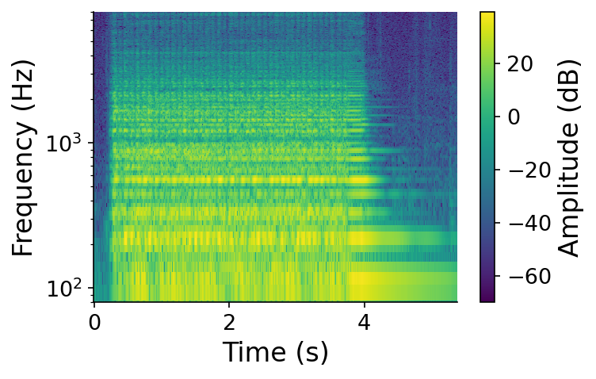
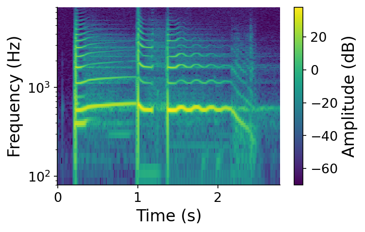
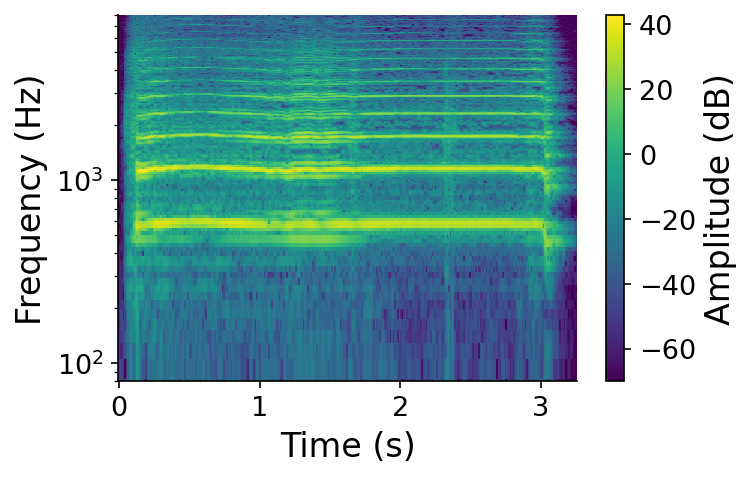

# 6. Modulation Synthesis

In this chapter we explore {vocab}`modulation synthesis`, a family of techniques for synthesizing richer and more dynamic musical sounds than the methods we have studied so far.

The word _modulation_ here means **affecting a property of one signal with another signal**. We have already seen this idea twice without naming it: multiplying a tone by an envelope ([Chapter 4](../04-score-timbre)) modulates its amplitude, and multiplying a signal by a complex sinusoid inside the Fourier transform ([Chapter 5](../05-frequency-domain)) modulates it to measure frequency content. Here, both of the signals involved will themselves be oscillating sinusoids.

When we studied additive synthesis ([Chapter 3](../03-additive-synthesis)), we saw that richer frequency-domain spectra ([Chapter 5](../05-frequency-domain)) give rise to more interesting musical material. Wavetable synthesis lets us synthesize rich _static_ spectra efficiently. But real musical sounds are not static. Their character changes _dynamically over time_, and often in a periodic fashion:

:::{audio-figure}
{audio}`Cello, tremolo <./assets/audio-cello-tremolo.wav>` 

{audio}`Guitar, vibrato <./assets/audio-guitar-vibrato.wav>` 

{audio}`Trumpet <./assets/audio-trumpet.wav>` 

Three real instruments, each changing over time. The cello's amplitude pulses (_tremolo_, seen as vertical ripples across the harmonics), the guitar's pitch wavers (_vibrato_, seen as wavy harmonic lines), and the trumpet's harmonic balance shifts continuously. Play each clip and watch its spectrogram. Sources from Freesound: [358372](https://freesound.org/s/358372/) by MTG ([CC BY 3.0](http://creativecommons.org/licenses/by/3.0/)), [52080](https://freesound.org/s/52080/) by guitarguy1985 ([CC0](http://creativecommons.org/publicdomain/zero/1.0/)), and [636487](https://freesound.org/s/636487/) by KhalDrogo12 ([CC0](http://creativecommons.org/publicdomain/zero/1.0/)).
:::

How would we synthesize these kinds of effects? When we studied the frequency domain, we learned that every sound has a unique recipe of frequency information. In principle, then, we could recreate any of these sounds by adding together a large number of sinusoids, each with its own time-varying amplitude. But this would be extraordinarily inefficient, potentially requiring hundreds of oscillators for a single note. **Modulation synthesis lets us emulate these complex dynamics with just a small number of oscillators.** We will build up from the simplest case (modulating amplitude) to the most powerful (modulating frequency).
