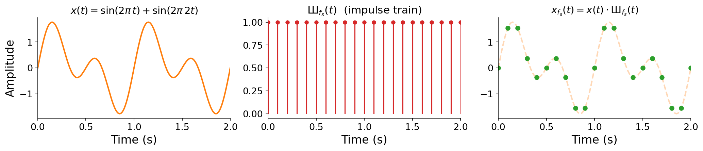
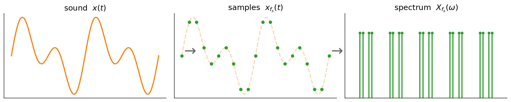
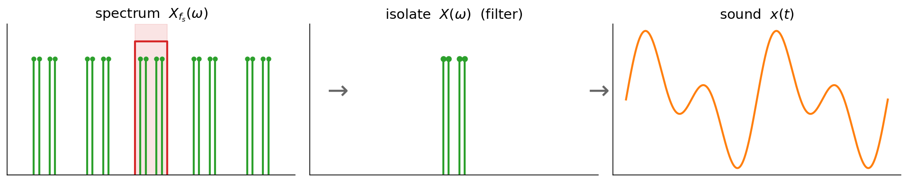
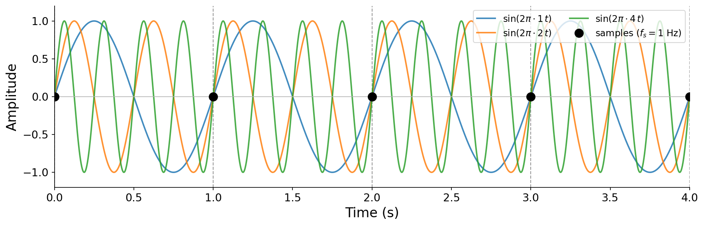

# 7.0 Sampling and the frequency domain

Let us briefly revisit sampling from {ref}`Chapter 1 <sec-sampling>`, setting quantization aside for now. To sample a continuous signal $x(t)$, we record its value at evenly spaced instants, at a {vocab}`sampling rate` of $f_s$ ${unit}`samples,second`$. The result is a sequence of samples

$$x[n] = x(n / f_s),$$

so that recording $T$ seconds of audio produces a vector $\mathbf{x} \in \mathbb{R}^{T \cdot f_s}$. That is the time-domain story. To bring in the frequency domain, we first need to look at the sampling operation from a slightly different angle.

## Sampling as multiplication

Here is a subtly different way to think about sampling. Instead of "reading off" values on a grid, imagine _multiplying_ the continuous signal $x(t)$ by a peculiar function that is 1 exactly on the sampling grid and 0 everywhere else. This function is called an {vocab}`impulse train`:

:::{margin}
The impulse train goes by many names, including the _Dirac comb_ and the _sampling function_. It is often written with the Cyrillic letter Ш ("sha"), whose shape evokes its comb-like graph.
:::

$$
\text{Ш}_{f_s}(t) = \begin{cases} 1 & \text{if } t \cdot f_s \in \mathbb{Z}, \\ 0 & \text{otherwise.} \end{cases}
$$

Multiplying our signal by this comb zeroes out everything between the sampling instants, while preserving the signal's value exactly at each instant $t = n/f_s$. In other words, sampling is multiplication by an impulse train:

$$x_{f_s}(t) = x(t) \cdot \text{Ш}_{f_s}(t).$$

The figure below shows this in the time domain, using the running example $x(t) = \sin(2\pi t) + \sin(2\pi 2 t)$. The continuous signal (left) is multiplied by an impulse train (middle) to produce a sampled signal (right) that is nonzero only on the grid.

:::{figure}

Sampling as multiplication in the time domain. The running example $x(t)$ (a sum of a 1 Hz and a 2 Hz sinusoid) is multiplied by the impulse train $\text{Ш}_{f_s}(t)$ to give the sampled signal $x_{f_s}(t) = x(t)\cdot\text{Ш}_{f_s}(t)$.
:::

## The frequency-domain view of sampling

Why bother reframing sampling as a multiplication? Because it lets us apply the Fourier transform. Recall from {ref}`Chapter 5 <sec-fourier-transform>` that the Fourier transform associates any time-domain signal $x(t)$ with a _unique_ frequency-domain representation $X(\omega)$. Crucially, **the Fourier transform makes no assumption that $x(t)$ is continuous or smooth**. It only requires that the signal be defined across all of $\mathbb{R}$. Our sampled signal $x_{f_s}(t)$, spiky and discontinuous as it is, still has a perfectly well-defined Fourier transform.

So what is the spectrum of the sampled signal? The bottom row of the figure below shows the answer, and it is striking. Multiplying by the impulse train in the time domain has the effect of **copying the original spectrum $X(\omega)$ around every integer multiple of the sampling rate $f_s$**. Where the original signal had frequency content only near zero, the sampled signal has infinitely many copies of that content, evenly spaced at $0, \pm f_s, \pm 2f_s, \ldots$

:::{figure}

Sampling as multiplication, viewed in both domains. Top (time): the running example $x(t)$ times the impulse train $\text{Ш}_{f_s}(t)$ gives the samples $x_{f_s}(t)$. Bottom (frequency): the spectrum $|X(\omega)|$ (spikes at $\pm 1$ and $\pm 2$ Hz) is _replicated_ around every integer multiple of $f_s$, producing $|X_{f_s}(\omega)|$. (All spectral amplitudes are drawn at 1 for clarity.)
:::

:::{prf:definition} Frequency-domain consequence of sampling
:label: def-sampling-copies
Sampling a signal at rate $f_s$ replicates its spectrum at every integer multiple of $f_s$. If $x(t)$ has spectrum $X(\omega)$, then the sampled signal $x_{f_s}(t)$ has spectrum

$$X_{f_s}(\omega) = \sum_{k=-\infty}^{\infty} X(\omega - k f_s).$$
:::

:::{note}
Why does multiplication in time produce _copies_ in frequency? Multiplying two signals in the time domain corresponds to an operation called _convolution_ in the frequency domain, and convolving a spectrum with a comb of spikes slides a copy of the spectrum to each spike. We will study convolution properly when we cover filtering in [Chapter 9](../09-filters). For now, the key takeaway is just the _result_: sampling creates infinitely many copies of the spectrum, spaced $f_s$ apart.
:::

## What this means in practice

We can now view the whole analog-to-digital and digital-to-analog pipeline in terms of the frequency domain. Analog-to-digital conversion (ADC) takes a continuous sound $x(t)$, multiplies it by an impulse train to produce samples $x_{f_s}(t)$, whose spectrum $X_{f_s}(\omega)$ consists of the infinite copies we just described:

:::{figure}

Analog-to-digital conversion. The continuous sound $x(t)$ is sampled into $x_{f_s}(t)$, whose spectrum $X_{f_s}(\omega)$ is the original baseband replicated at every multiple of $f_s$.
:::

Digital-to-analog conversion (DAC) has to run this backwards. From the copied spectrum $X_{f_s}(\omega)$, it must isolate the original baseband $X(\omega)$ (using a filter to discard the copies), and from that reconstruct the original sound $x(t)$:

:::{figure}

Digital-to-analog conversion. A filter isolates the central baseband $X(\omega)$ from among the copies, discarding the rest, and the continuous sound $x(t)$ is reconstructed from it.
:::

This leads to a genuinely counterintuitive insight:

:::{important}
As long as we can perfectly **identify and isolate** the original spectrum $X(\omega)$ among the shifted copies in $X_{f_s}(\omega)$, we can **perfectly reconstruct** $x(t)$ from its samples alone.
:::

This should feel surprising. Sampling is obviously throwing information away. It records the signal at a handful of instants and discards everything in between. In fact, infinitely many _different_ continuous signals pass through the exact same samples. The figure below shows three sinusoids at 1, 2, and 4 Hz that all cross zero at every integer, so sampled at $f_s = 1$ Hz they yield identical (all-zero) samples:

:::{figure}

Three different continuous signals that share identical samples. At $f_s = 1$ Hz, all three sinusoids are sampled at their zero crossings, so from the samples alone we cannot tell them apart.
:::

Given that many signals share the same samples, perfect reconstruction can only work under the right conditions. Understanding exactly when we can isolate the original spectrum is the heart of sampling theory.
