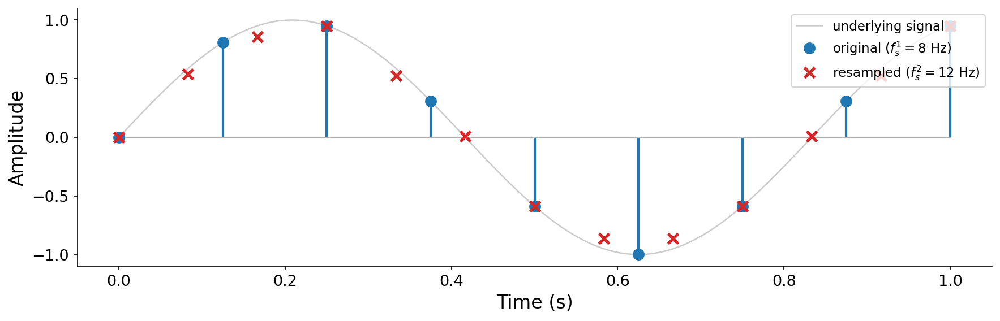

# 7.5 Resampling

It is often useful to _change_ the sample rate of audio after it has already been sampled, perhaps to shrink a file for transmission, or to combine two recordings made at different rates. This operation is called {vocab}`resampling`. Its type signature maps one sample vector to another, generally of a different length:

$$\mathbf{x} = [x[0], \ldots, x[N-1]] \;\longrightarrow\; \mathbf{y} = [y[0], \ldots, y[M-1]].$$

## Changing the sample rate

Suppose we want to convert audio from a rate $f_s^1$ to a new rate $f_s^2$, keeping its duration in seconds unchanged. Since duration is $N / f_s^1 = M / f_s^2$, the new length must be

$$M = N \cdot \frac{f_s^2}{f_s^1}.$$

To fill in the new samples, we read the original signal at the corresponding fractional positions. The $m$-th output sample comes from position $p = m \cdot f_s^1 / f_s^2$ in the original, which generally falls _between_ two original samples:

$$y[m] = \text{Interpolate}\!\left(\mathbf{x}, \; p = m \cdot \frac{f_s^1}{f_s^2}\right).$$

We already met this idea in {ref}`Chapter 3 <sec-wavetable-synthesis>`, where wavetable synthesis read a table at fractional positions. The simplest choice is linear interpolation between the two neighboring samples:

$$y[m] = (1 - \alpha)\, x[\lfloor p \rfloor] + \alpha \, x[\lfloor p \rfloor + 1], \qquad \alpha = p - \lfloor p \rfloor.$$

A standalone linear resampler, along with the aliasing and quantization helpers from this chapter, is in [code/sampling.py](./code/sampling.py).

:::{figure}


Resampling from $f_s^1 = 8$ Hz to $f_s^2 = 12$ Hz. Each new sample (red) is read from a fractional position between the original samples (blue) by interpolation.
:::

There is one critical caveat. When we lower the sample rate ($f_s^2 < f_s^1$), we shrink the Nyquist frequency, and any content above the _new_ Nyquist $f_s^2/2$ will alias, just as in the analog case. So before downsampling, we must first filter out everything above $f_s^2/2$, an anti-aliasing step we will be equipped to implement after studying filters in [Chapter 9](../09-filters). In practice, high-quality resamplers combine this filtering with a more sophisticated interpolation than the linear scheme above. Pyquist's `Audio.resample` handles both:

```python
import pyquist as pq

audio = pq.Audio.from_file("drums.wav")   # 44.1 kHz
half = audio.resample(22050)              # bandlimited, anti-aliased
low = audio.resample(8000)
```

Listen to a recording resampled to progressively lower rates. As the sample rate drops, the Nyquist frequency falls below the signal's high-frequency content, and that content is (properly) removed, so the sound grows progressively duller:

:::{audio-list}
{audio}`Original (44.1 kHz) <./assets/audio-resample-orig.wav>`

{audio}`Resampled to 22.05 kHz <./assets/audio-resample-22050.wav>`

{audio}`Resampled to 8 kHz <./assets/audio-resample-8000.wav>`

A recording resampled to lower rates. The 8 kHz version has a Nyquist frequency of only 4 kHz, so everything above that is gone and the sound is noticeably muffled. [666866](https://freesound.org/s/666866/) by MrJmix, License: [Attribution 4.0](https://creativecommons.org/licenses/by/4.0/).
:::

## Changing playback speed

We have actually seen resampling in one other guise already. When wavetable synthesis reads a table faster or slower to change its pitch, that is resampling. The same idea lets us change the _speed_ of a recording, and with it, its pitch.

Here the goal is to change a clip's duration from $T^1$ to $T^2$ while keeping the sample rate fixed. The new length is

$$M = N \cdot \frac{T^2}{T^1},$$

and we read the original at interpolated positions exactly as before, now with the ratio $T^1/T^2$:

$$y[m] = \text{Interpolate}\!\left(\mathbf{x}, \; p = m \cdot \frac{T^1}{T^2}\right).$$

Stretching or squeezing the signal in time shifts every frequency it contains by the factor $T^1/T^2$. Playing a clip at twice the speed halves its duration and raises every frequency by an octave, chipmunk-style.

Notice that changing the sample rate and changing the speed are fundamentally the _same_ operation. The only difference is the ratio used to convert between sample indices, and whether we play the result back at a new sample rate or the original one. In Pyquist, we can change speed by reinterpreting the sample rate and then resampling back:

```python
ratio = 2.0                                       # 2x speed, up an octave
sped_up = pq.Audio(audio.samples, int(audio.sample_rate * ratio))
sped_up = sped_up.resample(audio.sample_rate)
```

:::{audio-list}
{audio}`Original speed <./assets/audio-speed-1.wav>`

{audio}`Half speed (down an octave) <./assets/audio-speed-0p5.wav>`

{audio}`Double speed (up an octave) <./assets/audio-speed-2.wav>`

The same recording played at three speeds. Changing speed also changes pitch, because stretching the signal in time scales all of its frequencies.
:::
