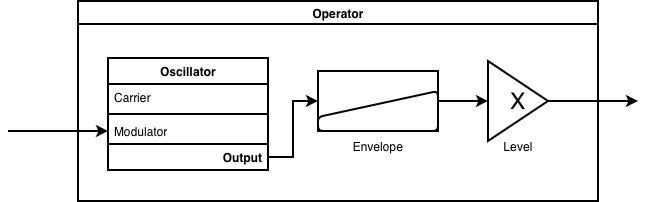
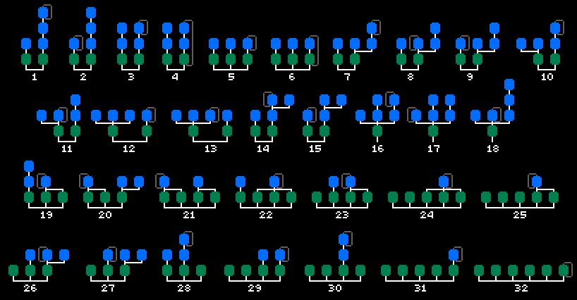

# Project 2: Wavetable Synthesis and Scores

## Part 1 (Autograded)

### Due: Mon Sep 21 2026 by 11:59PM Eastern

Download the project here and follow the instructions in the Python notebook: https://gclef-cmu.org/icm-autograde/projects-f26/3/starter.zip

### Submission

You will submit via Gradescope: https://www.gradescope.com/courses/1326756/assignments/8238309

See [resources](../../resources/index.md) for instructions on install Pyquist, configuring your Python notebook environment in VSCode, and submitting via Gradescope.

## Part 2 (Open-ended)

### Due: Mon Sep 28th 2026 by 11:59PM Eastern

**Accomplish _either_ of the open-ended project directions below**

### Direction 1 (Creative): A 30-60s Song

The FM oscillators you implemented in the Autograded section of the assignment allow for much more sophisticated sounds than what you've previously seen in the course. You can now make instruments with vibrato, portamento, and time-varying timbre qualities. Using what you've learned about envelopes, additive synthesis, and FM modulation, you will create a 30-60s song with some creative intent behind it. 

**Requirements**
- Define 2+ custom FM instruments which are meaningfully different from each other
- Configure your instruments to use time-varying parameters via enveopes or other oscillators
- 30 to 60 seconds in length 
- In `CREATIVE.md`, include
  - A description of your song and the creative intent behind it
  - A description of your FM instruments and how you configured them to achieve your desired sound

**You May Use**
- The TheoryTab or FreeSound API
- Any outside sources of audio (found or recorded)
  - Any outside audio material you use must be properly cited in your submission
- AI to aid implementation (no generating songs with Suno, Udio, etc.)
- Any DAW or editing software may be used to arrange and add effects, however a non-trivial amount of the track must be rendered by executing your submited code
  - Acceptable : Use Pyquist to generate stems for two FM voices, then add drums and reverb in the DAW 
  - Unacceptable : Generate a single 2-second FM sound effect, import into Kontakt, and compose most of the music in the DAW

Need a good place to start? 
- Experiemnt with strongly aliasing sidebands
- Use oscillators to make a spooky melody 
- Make an instrument who's _timbre_ changes over time
- Write a song inspired by a daily activity

### Direction 2 (Technical): A DX-7 Instrument

The DX-7 is a famous FM synthesizer made by Yamaha from the 1980s. It includes 32 preset algorithms that define how 6 FM operators are connected. Even with only a few routing patterns, these algorithms can produce a wide range of timbres by changing the frequency ratios, modulation depths, and envelopes of the individual operators. Most miraculously of all, it only uses FM sine wave oscillators (like task 2)! 

**Requirements**
- Implement **two** any of the 32 algorithms **EXCEPT** _Algorithms 24, 25, 29, 30, 31, 32_,  faithfully to the spec (explained below)
- All FM oscillators must only generate sine waves
- Create two meaninfully different sounds by changing the input parameters
- In `TECHNICAL.md`, include
  - Tell us which 2 algorithms you implemented 
  - Explain how you chose the parameters for your operators to create your two different sounds 

**You May Use**
- AI to aid implementation (no AI-generated _sounds_)
- Online resources about DX-7 algorithms for reference (please list them in your writeup)

#### DX-7 Algorithm
This algorithm is made up of 6 **operators**. Each operator must be provided with a carrier frequency, envelope, output level, and optionally, a modulation signal. Very simply, this is what an operator looks like : 

Below are the 32 different operator topologies. For clarity, and adjoining lines means signal addition, and incoming lines to an operator are chaining (akin to task 3).

Ultimately, we want to be able to call your instrument as follows : 
:::{code}
note = dx7_instrument(frequency=440.0, duration=2.0)
pq.play(note)
:::

**Tips + Notes**
- Each instrument is effectively a different set of input parameters to the 6 operators. 
- The instrument should play different notes -- consider how you compute the carrier frequencies to be flexible to changing pitches
- Don't underestimate the power of the envelope! 
- Wnat to learn more? Check out [This Website](https://yamahablackboxes.com/articles/how-to-program-yamaha-dx7/
) or [This one](https://www.tinyloops.com/doc/yamaha_dx7/algorithms.html) 

### Submission

First, confirm your project formatting is valid via Gradescope: https://www.gradescope.com/courses/1326756/assignments/8238316

Then, submit the **Gradescope-verified zip file** to Google Forms: https://forms.gle/2qSfJsG3A2EdoJnU8

## Grading

Your total project grade will be derived from following break down:

- 50% part 1
  - 35% autograded (full marks on Gradescope is full credit)
  - 15% free response (manually graded by TAs after submission)
- 50% part 2 (manually graded by TAs after submission)
  - 10% passes formatting checks on Gradescope
  - 40% manual grading by TAs, see [here][../index.md] for rubric
  - **Bonus** up to 10% for exceptional effort