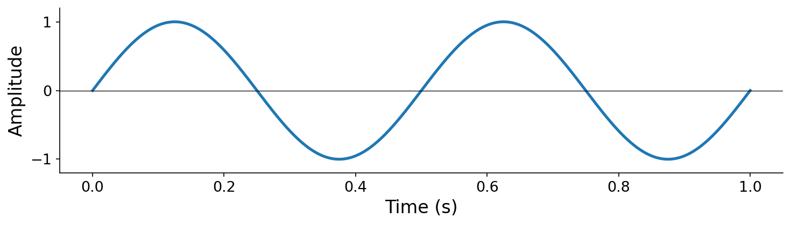
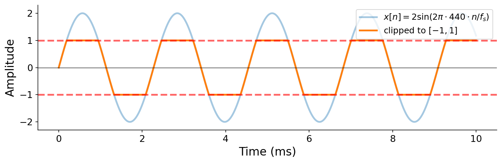
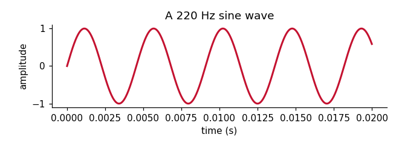

# Template - Markdown 

This page is a **living template** for **MyST Markdown** pages (`.md`). It
demonstrates every feature available when authoring a prose-only chapter —
formatting, math, admonitions, exercises, figures, cross-references, and
tables — but excludes notebook-only features (executable code cells, `glue`,
and cell tags). For those, see the {doc}`notebook template <template-notebook>`.

Use it two ways:

1. **As a reference** — skim the rendered page to see what is available.
2. **As a starting point** — copy `template.md`, rename it, and replace the
   content with your own.

(why-markdown)=
## 1. Markdown pages vs. notebooks

Every page in this book is one of two file types:

`.md` — a **MyST Markdown** file (this page)
: Prose, math, and directives. Best for chapters that are mostly explanation.
  Code blocks are displayed but **not executed**.

`.ipynb` — a **Jupyter notebook**
: Markdown cells *and* code cells. Code runs when the book is built, and its
  output — numbers, plots, audio players — is captured into the page. Best for
  anything that should *demonstrate running code*.

Markdown cells inside a notebook understand the **same MyST syntax** as a `.md`
file, so a notebook is a strict superset: everything in this template also
works inside a notebook.

:::{important}
If your page needs to *execute* {{ pyquist }} code, author it as a notebook
instead. See the {doc}`notebook template <template-notebook>` for the full set of
notebook-only features.
:::

## 2. Text formatting

Every page pairs the **Source** (what you type) with the **Rendered** result.

Source:

````markdown
**Bold**, *italic*, ***bold italic***, `inline code`, <del>strikethrough</del>,
H<sub>2</sub>O, x<sup>2</sup>, and a [hyperlink](https://pyquist.org). Press
{kbd}`Shift` + {kbd}`Enter` to run a cell. The {abbr}`DFT (Discrete Fourier Transform)`
abbreviation shows its meaning on hover.

> A blockquote — use it for short asides or quotations.

A horizontal rule follows:

---

Inline math such as $f = 440\,\text{Hz}$ flows inside running text.
````

Rendered:

**Bold**, *italic*, ***bold italic***, `inline code`, <del>strikethrough</del>,
H<sub>2</sub>O, x<sup>2</sup>, and a [hyperlink](https://pyquist.org). Press
{kbd}`Shift` + {kbd}`Enter` to run a cell. The {abbr}`DFT (Discrete Fourier Transform)`
abbreviation shows its meaning on hover.

> A blockquote — use it for short asides or quotations.

A horizontal rule follows:

---

Inline math such as $f = 440\,\text{Hz}$ flows inside running text.

## 3. Lists

Unordered, ordered, and nested.

Source:

````markdown
- First item
- Second item
  - Nested item
  - Another nested item
- Third item

1. Step one
2. Step two
3. Step three
````

Rendered:

- First item
- Second item
  - Nested item
  - Another nested item
- Third item

1. Step one
2. Step two
3. Step three

A **task list** (the `tasklist` extension).

Source:

````markdown
- [x] Install Pyquist
- [x] Write the template
- [ ] Write Chapter 1
````

Rendered:

- [x] Install Pyquist
- [x] Write the template
- [ ] Write Chapter 1

A **definition list** (the `deflist` extension).

Source:

````markdown
Sample rate
: The number of audio samples stored per second, in hertz.

Nyquist frequency
: Half the sample rate; the highest representable frequency.
````

Rendered:

Sample rate
: The number of audio samples stored per second, in hertz.

Nyquist frequency
: Half the sample rate; the highest representable frequency.

## 4. Admonitions

Admonitions are colored callout boxes. Swap `note` for `tip`, `important`,
`warning`, `seealso`, or `admonition` (with a custom title).

Source:

`````markdown
:::{note}
A **note** — neutral, supporting information.
:::

:::{tip}
A **tip** — practical advice.
:::

:::{important}
**Important** — do not miss this.
:::

:::{warning}
A **warning** — something that can go wrong.
:::

:::{seealso}
A **see-also** — a pointer to related material, e.g. the
{doc}`Pyquist reference <pyquist/Overview>`.
:::

:::{admonition} Custom title
:class: hint
The generic `{admonition}` directive takes a custom title and any color class.
:::
`````

Rendered:

:::{note}
A **note** — neutral, supporting information.
:::

:::{tip}
A **tip** — practical advice.
:::

:::{important}
**Important** — do not miss this.
:::

:::{warning}
A **warning** — something that can go wrong.
:::

:::{seealso}
A **see-also** — a pointer to related material, e.g. the
{doc}`Pyquist reference <pyquist/Overview>`.
:::

:::{admonition} Custom title
:class: hint
The generic `{admonition}` directive takes a custom title and any color class.
:::

A **collapsible** admonition (`:class: dropdown`).

Source:

````markdown
:::{admonition} Click to expand
:class: dropdown note
Hidden until the reader clicks.
:::
````

Rendered:

:::{admonition} Click to expand
:class: dropdown note
Hidden until the reader clicks.
:::

## 5. Audio

MyST has no native audio directive, so the book adds one: the custom `{audio}`
directive for a single clip (defined in `_ext/icm_audio.py`), plus a multimodal
grid convention for pairing audio with images.

### 5.1 Audio clips — the `{audio}` directive

For short audio clips shipped alongside a chapter (a recorded sample, a pre-rendered WAV), use the `{audio}` directive. Its body is a Markdown link to the clip — the link text describes it — followed by an optional caption. The directive renders a clean **`audio-block` card**: a large round play/pause button (the same control as the inline `{audio}` role) beside the caption, on a subtle tinted panel. The link text becomes the button's `aria-label`/tooltip. This is a book-specific directive — see `directives.md`, defined in `_ext/icm_audio.py` (behavior wired by `_static/audio-chip.js`). Its body matches the upstream `icm-text` source verbatim; only the fence marker differs (`:::audio` there, `:::{audio}` here).

Source:

````markdown
:::{audio}
[A 440 Hz sine tone](./ch01/assets/audio-sine-440.wav)

A 440 Hz sine tone, one second long, at $f_s = 44{,}100$ Hz.
:::
````

Rendered:

:::{audio}
[A 440 Hz sine tone](./ch01/assets/audio-sine-440.wav)

A 440 Hz sine tone, one second long, at $f_s = 44{,}100$ Hz.
:::

For audio *generated* at build time by executable Pyquist code, use a notebook
page with `pq.play(audio)` — see the {doc}`notebook template <template-notebook>`.

### 5.2 Inline audio and audio grids

For a clip *inline* — mid-sentence, or paired with a waveform image — use the
`{audio}` **role** (the inline counterpart of the `{audio}` directive above):
`` {audio}`label <url>` ``. It renders a small round **play/pause button**
(wired by `_static/audio-chip.js`) **followed by the label** — so the clip is
self-contained, no separate text needed. `$…$` in the label renders as math.

To compare several clips under one shared caption, group them: **one paragraph
per item**, then a final paragraph as the **shared caption**. Three wrappers
(styled in `_static/custom.css`):

- `audio-figure` — each clip paired with its **own waveform image**; narrow grid
  columns for a side-by-side comparison.
- `audio-board` — several clips above **one combined plot** (the image is its own
  paragraph); the buttons flow in a centered row, the plot spans full-width below.
- `audio-list` — clips with **text labels** only; wider columns so each label
  sits on one line.

(For the upstream `:::figure` source the split tool picks the wrapper
automatically: `audio-figure` if every clip has its own image, `audio-board` if
the clips share a standalone image, else `audio-list`.) Source:

````markdown
:::{audio-figure}
{audio}`Clean 440 Hz sine <./ch01/assets/audio-sine-440.wav>` 

{audio}`Clipped 440 Hz sine <./ch01/assets/audio-clipped-sine.wav>` 

A clean 440 Hz sine (left) and the same tone clipped (right) — play each, then compare its waveform.
:::
````

Rendered:

:::{audio-figure}
{audio}`Clean 440 Hz sine <./ch01/assets/audio-sine-440.wav>` 

{audio}`Clipped 440 Hz sine <./ch01/assets/audio-clipped-sine.wav>` 

A clean 440 Hz sine (left) and the same tone clipped (right) — play each, then compare its waveform.
:::

A text-only list of examples uses `audio-list` instead:

````markdown
:::{audio-list}
{audio}`A clean 440 Hz sine <./ch01/assets/audio-sine-440.wav>`

{audio}`The same tone, hard-clipped <./ch01/assets/audio-clipped-sine.wav>`

Two tones to compare by ear.
:::
````

Rendered:

:::{audio-list}
{audio}`A clean 440 Hz sine <./ch01/assets/audio-sine-440.wav>`

{audio}`The same tone, hard-clipped <./ch01/assets/audio-clipped-sine.wav>`

Two tones to compare by ear.
:::

In the upstream `icm-text` source these are authored as `:audio[label](url)`,
`:figure`, and a `:::figure` wrapper; the split tool folds each
clip's `[label]` into the `{audio}` role (dropping any descriptive text beside
it) and picks the `audio-figure` / `audio-board` / `audio-list` wrapper shown
here.

## 6. Mathematics

**Inline and display math.**

Source:

````markdown
Inline math: the angular frequency is $\omega = 2\pi f$.

Display math:

$$
x(t) = A \sin(2\pi f t + \phi)
$$
````

Rendered:

Inline math: the angular frequency is $\omega = 2\pi f$.

Display math:

$$
x(t) = A \sin(2\pi f t + \phi)
$$

A **labeled, numbered** equation, referenced inline with `` {eq}`eq-euler-md` ``.

Source:

````markdown
:::{math}
:label: eq-euler-md
e^{i\pi} + 1 = 0
:::

…see equation {eq}`eq-euler-md`.
````

Rendered:

:::{math}
:label: eq-euler-md
e^{i\pi} + 1 = 0
:::

…see equation {eq}`eq-euler-md`.

**Aligned, multi-line math.**

Source:

````markdown
$$
\begin{aligned}
X[k] &= \sum_{n=0}^{N-1} x[n]\, e^{-i 2\pi k n / N} \\
     &= \sum_{n=0}^{N-1} x[n]\,\big(\cos\theta - i\sin\theta\big)
\end{aligned}
$$
````

Rendered:

$$
\begin{aligned}
X[k] &= \sum_{n=0}^{N-1} x[n]\, e^{-i 2\pi k n / N} \\
     &= \sum_{n=0}^{N-1} x[n]\,\big(\cos\theta - i\sin\theta\big)
\end{aligned}
$$

Colored terms, using the macros defined in `_config.yml`:
`$\blue{a} + \red{b} = \green{c}$` → $\blue{a} + \red{b} = \green{c}$.

## 7. Code blocks (not executed)

A plain fenced block is shown with syntax highlighting but **not run**:

```python
# Illustration only — this block does not execute.
import pyquist as pq
audio = pq.Audio(samples, sample_rate=44100)
```

The `{code-block}` directive adds line numbers and line emphasis:

:::{code-block} python
:linenos:
:emphasize-lines: 2

def gain(audio, factor):
    audio.samples *= factor      # the emphasized line
    return audio
:::

:::{important}
In a `.md` file, code blocks are **always** display-only. To run code at build
time, author the page as a notebook instead.
:::

## 8. Figures and images

For most figures you only need an image and a caption — write the image as the
first line of a `{figure}` block (no options, no path argument). Source:

````markdown
:::{figure}


A sine waveform — a static image stored in `content/images/`.
:::
````

renders as:

:::{figure}


A sine waveform — a static image stored in `content/images/`.
:::

When you need to size, align, or **cross-reference** a figure, use the standard
form instead: pass the path as the directive argument and add options. `:name:`
makes it referenceable with `{numref}`. Source:

````markdown
:::{figure} images/template-waveform.png
:name: fig-waveform-md
:width: 80%
:align: center

A sine waveform, sized and named.
:::

See {numref}`fig-waveform-md` for an auto-numbered link.
````

renders as:

:::{figure} images/template-waveform.png
:name: fig-waveform-md
:width: 80%
:align: center

A sine waveform, sized and named.
:::

See {numref}`fig-waveform-md` for an auto-numbered link.

## 9. Tables

A plain Markdown table.

Source:

````markdown
| Waveform | Harmonic content |
| -------- | ---------------- |
| Sine     | Fundamental only |
| Square   | Odd harmonics |
| Sawtooth | All harmonics |
````

Rendered:

| Waveform | Harmonic content |
| -------- | ---------------- |
| Sine     | Fundamental only |
| Square   | Odd harmonics |
| Sawtooth | All harmonics |

The `{list-table}` directive (easier for long cell text; supports a caption and
label).

Source:

````markdown
:::{list-table} Synthesis methods
:header-rows: 1
:name: tbl-methods-md

* - Method
  - Idea
* - Additive
  - Sum sinusoids
* - Subtractive
  - Filter a harmonically rich source
:::
````

Rendered:

:::{list-table} Synthesis methods
:header-rows: 1
:name: tbl-methods-md

* - Method
  - Idea
* - Additive
  - Sum sinusoids
* - Subtractive
  - Filter a harmonically rich source
:::

The `{csv-table}` directive.

Source:

````markdown
:::{csv-table} Common sample rates
:header-rows: 1

Use, Rate (Hz)
Telephone, 8000
CD audio, 44100
Studio, 48000
:::
````

Rendered:

:::{csv-table} Common sample rates
:header-rows: 1

Use, Rate (Hz)
Telephone, 8000
CD audio, 44100
Studio, 48000
:::

## 10. Cross-references and citations

| Target | Role | Live example |
| ------ | ---- | ------------ |
| A labeled section | `` {ref}`label` `` | {ref}`why-markdown` |
| A numbered figure | `` {numref}`label` `` | {numref}`fig-waveform-md` |
| Another page | `` {doc}`path` `` | {doc}`About <about>` |
| An equation | `` {eq}`label` `` | {eq}`eq-euler-md` |
| A theorem | `` {prf:ref}`label` `` | {prf:ref}`thm-nyquist-md` |

**Citations** pull from `content/references.bib`. Cite with
`` {cite}`dannenberg1997machine` `` → {cite}`dannenberg1997machine`. Every
citation is collected automatically on the {doc}`References <references>` page.

## 11. Footnotes

Footnotes attach a small reference that collects at the foot of the page.

Source:

````markdown
Footnotes attach a small reference[^demo] that collects at the foot of the page.

[^demo]: This is the footnote text. Footnotes suit asides and source notes.
````

Rendered:

Footnotes attach a small reference[^demo] that collects at the foot of the page.

[^demo]: This is the footnote text. Footnotes suit asides and source notes.

## 12. Margin content

The `{margin}` directive (from `sphinx-book-theme`) pushes a block into the
right margin, aligned with the paragraph it follows. Use it for short asides,
side figures, or callouts that shouldn't break the flow of the main text.

:::{important}
Because margin blocks float out of the normal flow, they appear **beside the
paragraph that immediately follows them**, not below a "Rendered:" label. The
example below has a dedicated anchor paragraph so the margin content lines up
correctly.
:::

Source:

````markdown
:::{margin} An aside
The {{ pyquist }} library is named after Harry Nyquist (1889–1976), whose
sampling theorem underpins all of digital audio.
:::

Rendered → look to the right of *this* paragraph. The margin block sits next
to the paragraph that follows its source. Keep the anchor paragraph at least
as tall as the margin content so the next section isn't displaced.
````

:::{margin} An aside
The {{ pyquist }} library is named after Harry Nyquist (1889–1976), whose
sampling theorem underpins all of digital audio.
:::

Rendered → look to the right of *this* paragraph. The margin block sits next
to the paragraph that follows its source. Keep the anchor paragraph at least
as tall as the margin content so the next section isn't displaced.

You can also push a `{figure}` to the margin by adding `:class: margin` — handy
for side illustrations that comment on the body text without interrupting it.

## 13. Exercises and solutions

The `sphinx-exercise` extension provides `{exercise}` and `{solution}`. Source:

````markdown
:::{exercise}
:label: ex-demo-md
State the Nyquist frequency for a 48 kHz sample rate.
:::

:::{solution} ex-demo-md
:class: dropdown
24 kHz — half the sample rate.
:::
````

renders as:

:::{exercise}
:label: ex-demo-md
State the Nyquist frequency for a 48 kHz sample rate.
:::

:::{solution} ex-demo-md
:class: dropdown
24 kHz — half the sample rate.
:::

A **gated** exercise (`{exercise-start}` … `{exercise-end}`) can wrap several
blocks:

:::{exercise-start}
:label: ex-gated-md
:::

Describe the spectrum of a 330 Hz sawtooth wave. Which harmonics are present,
and how do their amplitudes fall off?

:::{exercise-end}
:::

## 14. Theorems, proofs, and definitions

The `sphinx-proof` extension provides `{prf:theorem}`, `{prf:proof}`,
`{prf:definition}`, `{prf:lemma}`, `{prf:example}`, and `{prf:algorithm}`.

Source:

`````markdown
:::{prf:definition} Sample rate
:label: def-sample-rate-md
The **sample rate** is the number of samples stored per second of audio.
:::

:::{prf:theorem} Nyquist–Shannon sampling theorem
:label: thm-nyquist-md
A signal containing no frequencies above $f_\text{max}$ is fully determined by
samples taken at a rate $f_s > 2\,f_\text{max}$.
:::

:::{prf:proof}
A full proof is omitted in this template; see any signal-processing text.
:::

:::{prf:example}
At $f_s = 44100$ Hz, frequencies up to $22050$ Hz can be represented.
:::
`````

Rendered:

:::{prf:definition} Sample rate
:label: def-sample-rate-md
The **sample rate** is the number of samples stored per second of audio.
:::

:::{prf:theorem} Nyquist–Shannon sampling theorem
:label: thm-nyquist-md
A signal containing no frequencies above $f_\text{max}$ is fully determined by
samples taken at a rate $f_s > 2\,f_\text{max}$.
:::

:::{prf:proof}
A full proof is omitted in this template; see any signal-processing text.
:::

:::{prf:example}
At $f_s = 44100$ Hz, frequencies up to $22050$ Hz can be represented.
:::

## 15. Panels: tabs, cards, dropdowns, buttons

These come from the `sphinx-design` extension.

**Tab set.**

Source:

`````markdown
::::{tab-set}
:::{tab-item} macOS
`brew install ...`, then `pip install ...`
:::
:::{tab-item} Linux
`apt install ...`, then `pip install ...`
:::
:::{tab-item} Windows
Use Command Prompt with `py -m pip install ...`
:::
::::
`````

Rendered:

::::{tab-set}
:::{tab-item} macOS
`brew install ...`, then `pip install ...`
:::
:::{tab-item} Linux
`apt install ...`, then `pip install ...`
:::
:::{tab-item} Windows
Use Command Prompt with `py -m pip install ...`
:::
::::

**Card grid** (responsive: 1 column on phones, 2 on wide screens).

Source:

`````markdown
::::{grid} 1 1 2 2
:::{grid-item-card} Synthesis
Generate sound from scratch.
:::
:::{grid-item-card} Analysis
Measure and visualize sound.
:::
::::
`````

Rendered:

::::{grid} 1 1 2 2
:::{grid-item-card} Synthesis
Generate sound from scratch.
:::
:::{grid-item-card} Analysis
Measure and visualize sound.
:::
::::

**Dropdown.**

Source:

````markdown
:::{dropdown} Show the answer
The answer stays hidden until the reader clicks.
:::
````

Rendered:

:::{dropdown} Show the answer
The answer stays hidden until the reader clicks.
:::

**Button and badges.**

Source:

````markdown
:::{button-link} https://pyquist.org
:color: primary
:expand:
Open the Pyquist documentation
:::

Inline badges: {bdg-primary}`primary` {bdg-secondary}`secondary`
{bdg-success}`success` {bdg-danger}`danger`.
````

Rendered:

:::{button-link} https://pyquist.org
:color: primary
:expand:
Open the Pyquist documentation
:::

Inline badges: {bdg-primary}`primary` {bdg-secondary}`secondary`
{bdg-success}`success` {bdg-danger}`danger`.

## 16. Substitutions

Substitutions are reusable snippets defined once in `_config.yml` and inserted
with `{{ name }}`. This book defines, among others, `{{ course }}`.

Source:

````markdown
> The course is **{{ course }}**.
````

Rendered:

> The course is **{{ course }}**.

Edit `myst_substitutions` in `_config.yml` to add your own.

## 17. Using this template

To start a new prose-only chapter:

1. Copy `content/template.md`.
2. Rename it and move it into a `chNN-*/` folder.
3. Register it in `_toc.yml`.
4. Replace the content with your own.

:::{admonition} Before publishing
:class: warning
Remove this **Markdown Template** page from `_toc.yml` — it is an author
reference, not course content.
:::

:::{seealso}
For pages that need to execute {{ pyquist }} code at build time, start from
the {doc}`notebook template <template-notebook>` instead.
:::

## 18. Custom roles: vocabulary and units

Two book-specific inline shorthands for the book's house style.

Use `{vocab}` when introducing a term for the first time. It italicizes the term
and links it to its definition in the {doc}`Glossary <glossary>`.

Source:

````markdown
A signal is {vocab}`periodic` if it repeats.
````

Rendered:

A signal is {vocab}`periodic` if it repeats.

Use `{unit}` to typeset units. One argument renders a single unit; two render a
fraction (numerator over denominator), with the two separated by a comma (or a
slash). Unlike `{vocab}`, `{unit}` is **not** a role: it expands to raw LaTeX
(`\text{…}` or `\frac{\text{…}}{\text{…}}`) and does **not** inject math mode.
Wrap it in `$…$` to use it inline, or drop it unwrapped into a `$$…$$` block so
it composes with the surrounding equation.

Source:

````markdown
Inline, wrap it in math: the period is measured in ${unit}`seconds,cycle`$,
frequency in ${unit}`cycles,second`$, and an angle in ${unit}`radians`$.

In display math, drop it in unwrapped:

$$
\text{bitrate} \left[ {unit}`bits,second` \right]
  = f_s \left[ {unit}`samples,second` \right] \cdot b \left[ {unit}`bits,sample` \right].
$$
````

Rendered:

Inline, wrap it in math: the period is measured in ${unit}`seconds,cycle`$,
frequency in ${unit}`cycles,second`$, and an angle in ${unit}`radians`$.

In display math, drop it in unwrapped:

$$
\text{bitrate} \left[ {unit}`bits,second` \right]
  = f_s \left[ {unit}`samples,second` \right] \cdot b \left[ {unit}`bits,sample` \right].
$$

## 19. Linking to the Pyquist API

Use `{pyquist}` to mention a Pyquist symbol in prose. It renders the name as
inline code spelled the way students write it (`pq.…`) and links it to the
matching entry in the {doc}`Pyquist reference <pyquist/Overview>`. An unknown
symbol warns at build time, so the prose and the library stay in sync.

The display always shows valid, copy-pasteable code, so what you write and what
you see can differ:

| You write | Renders as | Why |
| --------- | ---------- | --- |
| `` {pyquist}`Score` `` | {pyquist}`Score` | re-exported at the top level |
| `` {pyquist}`Audio.segment` `` | {pyquist}`Audio.segment` | method of a top-level class |
| `` {pyquist}`frequency_to_pitch` `` | {pyquist}`frequency_to_pitch` | qualified, since it lives in a submodule |
| `` {pyquist}`score.Score` `` | {pyquist}`score.Score` | author-qualified, shown verbatim |
| `` {pyquist}`audio` `` | {pyquist}`audio` | a whole submodule |

Source:

````markdown
In Pyquist, scores are represented using the {pyquist}`score.Score` object, and
each entry is a {pyquist}`Event`. Convert between pitch and frequency with
{pyquist}`frequency_to_pitch` and {pyquist}`pitch_to_frequency`, and slice audio
with {pyquist}`Audio.segment`.
````

Rendered:

In Pyquist, scores are represented using the {pyquist}`score.Score` object, and
each entry is a {pyquist}`Event`. Convert between pitch and frequency with
{pyquist}`frequency_to_pitch` and {pyquist}`pitch_to_frequency`, and slice audio
with {pyquist}`Audio.segment`.

Prefer `{pyquist}` over a hand-written `` `pq.Score` `` whenever you name a real
symbol: it stays a working link as the API moves, and a typo becomes a build
warning instead of dead text. For the library *as a whole*, the prose
substitution {{ pyquist }} (a plain link to its home page) is still the right
tool.
